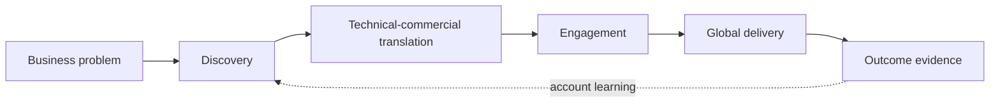

# Inside Globant

## How a Global Technology Services Company Connects Business Problems with Global Engineering Talent

This is a research-driven case study of Globant and the global technology-services industry.

It investigates how distributed engineering capability becomes customer relationships, technical solutions, signed engagements, delivery, and account growth.

## Start Reading

- **[Start Here](START-HERE.md)** — choose a short reading path.
- **[Preface](PREFACE.md)** — begin the book in sequence.
- **[Full Contents](CONTENTS.md)** — browse all 70 chapters and appendices.

## Print Edition

Build the complete US Letter PDF edition with one command:

```sh
./scripts/build-pdf.sh
```

The generated book is written to `dist/inside-globant.pdf`. See the [PDF build guide](docs/PDF_BUILD.md) for requirements, source ordering, and validation details.

## What This Book Investigates

The book follows one question: how does a global technology-services company connect a customer's business problem to engineering talent distributed across countries? Globant provides the case. Its public filings, customer accounts, partner materials, and other public sources reveal much about the company while leaving confidential negotiations and internal processes appropriately unknown.

## The Five Parts

- **[Part I — Understanding the Globant Machine](chapters/part-1-understanding-globant/README.md):** the offer, operating model, economics, and commercial–technical–delivery chain.
- **[Part II — Follow the Customers](chapters/part-2-customers/README.md):** documented customer examples and what buyers actually purchase.
- **[Part III — How Deals Happen](chapters/part-3-how-deals-happen/README.md):** access, discovery, solution shaping, commercial commitment, and handoff.
- **[Part IV — The Partner Ecosystem](chapters/part-4-partner-ecosystem/README.md):** platforms, alliances, implementation work, and co-selling.
- **[Part V — From Globant to the Small Global Engineering Firm](chapters/part-5-lessons-for-small-firms/README.md):** which capabilities can scale down and where smaller firms face gaps.

## Central Model

> **General industry model:** The sequence below is a conceptual services lifecycle, not Globant's disclosed internal process. Each arrow is conditional.



See the curated [Key Diagrams](appendix/key-diagrams.md) for the book's most useful visual models.

## Research Method

The book distinguishes **documented fact**, **reasonable inference**, **general industry model**, and **unknown**. [About This Book](ABOUT-THIS-BOOK.md) explains those categories and the limits of public research. The detailed [source register](sources/source-register.md) preserves research traceability.

## Useful Indexes

- [Key Lessons](appendix/key-lessons.md)
- [Customer Index](appendix/customer-index.md)
- [Partner Index](appendix/partner-index.md)
- [Glossary](appendix/glossary.md)
- [Bibliography](appendix/bibliography.md)
- [Evidence Gaps](sources/evidence-gaps.md)

## Status

*Inside Globant* is an independent, research-driven educational case study based on publicly available information. It is not commissioned by Globant and is not investment advice. The text may evolve as public evidence changes; dated claims should be read with their reporting periods and linked sources.
