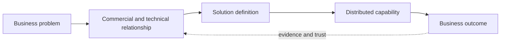

[Inside Globant](../../README.md) · [Part I — Understanding the Globant Machine](README.md)

# Chapter 0 — The Globant Question

Calling Globant a “software company” confuses what it produces with how it earns. A product company ordinarily builds one replicable asset and sells access many times. Globant primarily earns by applying people and capabilities to client work. Calling it an “outsourcing company” is also too thin: it suggests that a buyer hands over a fixed specification to cheaper programmers. Globant's regulatory description instead spans strategy, experience, engineering, data and AI, and enterprise platforms, delivered through long-lived client relationships ([Globant FY2024 Form 20-F, pp. 31–40](https://www.sec.gov/edgar/browse/?CIK=1557860&owner=exclude)).

**Documented fact.** Globant is a Luxembourg public limited liability company, trades on the NYSE as GLOB, and reports one operating segment in its Form 20-F. Its origins and much of its delivery heritage are Latin American. Those facts create the case-study puzzle: demand, corporate domicile, client relationships, specialists, and delivery need not occupy the same place.

## The unit of analysis is an engagement

An engineer sees repositories, APIs, cloud accounts, and releases. A business sponsor sees conversion, operating cost, regulatory exposure, time to market, or a product that must exist. Between them is an engagement: a temporary or continuing organization that converts an incompletely specified business need into governed work.

The arrows are not automatic. Before engineers can deliver, somebody must find or sustain the relationship, discover constraints, translate value into a scope, assemble credible specialists, agree price and risk, and govern delivery. A later renewal requires evidence of value and confidence in the team.

## Actors—not assumed job titles

We will encounter business buyers and executive sponsors; sales or business-development professionals; account relationships; consultants; architects and other technical specialists; engineers; delivery leaders; and technology partners. Public job titles or biographies can show that roles exist. They rarely show who had decision rights on a particular engagement.

That limitation matters. “Sales engineer” is familiar in SaaS, where a person demonstrates a mostly fixed product. A services opportunity may instead require a changing coalition of account, consulting, architecture, Studio, commercial, and delivery expertise. This book therefore asks **who performs a function** rather than assigning a conventional title without evidence.

## Four tests for every claim

1. **Offer:** what did the buyer obtain—labor capacity, an output, access to specialist knowledge, managed operation, or some mixture?
2. **Connection:** what public evidence links the business problem to the proposed technical work?
3. **Production:** which people, locations, platforms, and governance could make delivery possible?
4. **Outcome:** is an outcome measured, merely claimed, or not disclosed?

**Reasonable inference.** Globant's scale is valuable only if it can repeatedly perform the connecting work, not merely employ engineers. **Unknown.** Public sources do not reveal a universal Globant opportunity lifecycle, approval matrix, staffing algorithm, utilization target, or commission design. Chapter 9 will build a conceptual chain while keeping those gaps visible.

## Two misleading mental models

The **labor-arbitrage model** says value is simply the difference between a client's local wage and a remote engineer's wage. It catches one possible cost input but misses recruiting, specialist leadership, non-billable capacity, sales cost, delivery risk, facilities, currency, and provider margin. More importantly, it cannot explain why a buyer would select one provider over another with access to similar labor markets.

The **consultancy-as-oracle model** makes the opposite error. It imagines that advice itself transforms the client. Recommendations have value only when a client can decide, fund, implement, adopt, and operate them. Globant is instructive because its public offer extends from advisory language into engineering execution. The analytical question is how those modes join, not which label sounds more prestigious.

Throughout the book, read public material at three levels. A regulatory filing is designed to disclose material company information and risks, but remains aggregate. A service page tells us the proposition Globant takes to market, not whether any one customer bought all of it. A customer story gives engagement detail selected for publication, not a complete causal evaluation. Triangulation is necessary because no source type can answer the whole question.

## Questions to Think About

1. If code is the output, why is an engagement—not a repository—the useful unit for studying a services firm?
2. Which link in the diagram is hardest for a technically excellent but commercially inexperienced firm to build?
3. What evidence would distinguish outcome selling from polished descriptions of staff augmentation?
4. Why might the same person perform several connecting functions in one deal but not another?

---

[Previous Chapter](../../PREFACE.md) | [Table of Contents](../../CONTENTS.md) | [Next Chapter](01-from-argentina-to-global-company.md)
