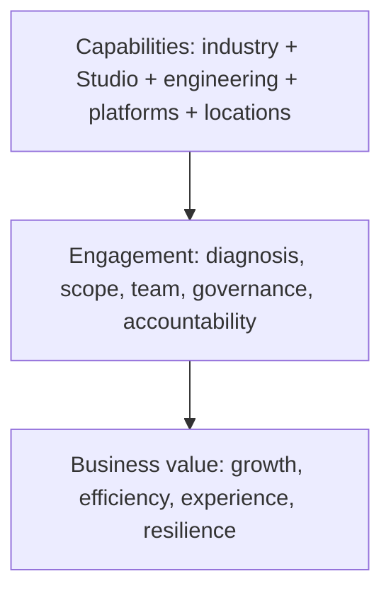

[Inside Globant](../../README.md) · [Part I — Understanding the Globant Machine](README.md)

# Chapter 2 — What Globant Actually Sells

Globant does not sell a single packaged product. It sells organized intervention in a client's business and technology system. The tangible outputs may be research, a roadmap, a redesigned journey, software, a migrated platform, a model, integrations, or an operated service. The commercial object is access to a provider that can define and deliver some combination of those outputs.

Globant's current website groups capabilities under areas including strategy and consulting, enterprise platforms, cloud, data and AI, digital experience, and engineering, expressed through its Studio network ([services](https://www.globant.com/services), [Studios](https://www.globant.com/studios)). Marketing categories overlap; the table translates them into buyer terms without asserting a standard contract form.

| Offer language | What the buyer is purchasing | Problem addressed | Delivery ingredients | Why not merely individuals? |
|---|---|---|---|---|
| Strategy / transformation consulting | diagnosis, choices, roadmap, change support | investment is needed but destination or sequence is unclear | industry context, facilitation, operating-model and technical analysis | an integrated recommendation needs senior accountability and cross-domain synthesis |
| Product and software engineering | a team or program able to design, build, test and evolve products | insufficient capacity, speed, or product-engineering capability | product management, architecture, UX, development, QA, DevOps/SRE | coordinated lifecycle and delivery governance matter alongside coding |
| Customer experience | research and redesigned digital/physical journeys plus implementation | fragmented channels, poor conversion or weak engagement | research, service design, content, front ends, analytics, integration | experience changes cross organizational and system boundaries |
| Cloud | assessment, migration, modernization, platform engineering or operation | legacy constraints, scalability, resilience, cost and delivery friction | cloud architecture, security, DevOps, FinOps, data and application modernization | migration risk and platform operating practices require multidisciplinary execution |
| Data and AI | data foundations, analytics, models/agents and workflow integration | inaccessible data or decisions/processes that could be augmented | governance, data engineering, ML/GenAI, evaluation, security, product integration | a model demo has little value without data, controls, workflow and adoption |
| Enterprise platforms | implementation and extension of systems such as Salesforce, SAP or ServiceNow | core processes fragmented across systems | platform configuration, process design, integration, data migration, change | platform and industry knowledge must meet existing architecture |

## Three layers of the offer

The bottom layer is what Globant **has**. The middle is what a buyer can actually contract and manage. The top is why a sponsor should care. Marketing often jumps from capability to value; solution definition must build the missing middle.

## “Digital transformation” made concrete

Digital transformation is not a deliverable. It is a portfolio label for changing customer propositions, processes, decisions, and enabling systems. A credible engagement must narrow it: Which journey? Which operating metric? Which applications and data? Which people must adopt a new process? What is released first? Who owns risk?

Similarly, “AI” can mean advisory work, a data platform, a model-enabled feature, employee tooling, workflow automation, or managed operation. Globant's AI materials establish that it offers AI-related capability and products; they do not establish that every engagement uses AI or produces a stated return ([AI services](https://www.globant.com/artificial-intelligence)).

## Capacity, output, and outcome

A services agreement can emphasize capacity (a team for a period), output (defined artifacts or functionality), or outcome (a business result). Public case studies usually do not publish the statement of work, price, acceptance terms, or risk allocation. It would therefore be unsafe to declare that Globant “sells outcomes” in every case. A better formulation is:

* **Documented fact:** Globant markets multidisciplinary capabilities and describes client business results.
* **Reasonable inference:** specialization and end-to-end capability allow it to compete for broader responsibility than isolated developer placement.
* **Unknown:** the capacity/output/outcome mix and pricing model of a particular undisclosed contract.

What Globant sells, then, is **credible access to coordinated knowledge and execution**, shaped into engagements. That formulation includes engineering without reducing the enterprise to engineering labor.

## A worked buying conversation

Suppose a retailer says, “We need AI-powered personalization.” That sentence is demand, not scope. Consulting questions whether the objective is conversion, retention, merchandising productivity, or service cost. Experience specialists identify where a recommendation changes a journey. Data specialists inspect consent, identity, catalog quality, events, and evaluation data. Architects decide where models and rules integrate with commerce systems. Engineers build and operate the selected slice. Change leaders consider how merchandisers and service teams will use it.

The buyer could purchase these activities separately, and sometimes should. Globant's broad offer creates the possibility of contracting a connected intervention. Its burden is to demonstrate that coordination is better than a loose collection of specialists and that it will not use breadth to expand scope without value. No public services page settles that burden for a particular deal.

## What a technical reader should inspect

When evaluating a services proposal, replace nouns with commitments. “Cloud” becomes applications assessed, landing zones established, workloads migrated, controls implemented, and operations transferred. “Customer experience” becomes users researched, journeys redesigned, channels built, measures instrumented, and owners trained. Then ask which assumptions depend on the client, which output has acceptance criteria, which risk is priced, and which result is merely aspirational. This discipline is the bridge between marketing category and deliverable system.

## Questions to Think About

1. At which of the three layers does a technically strong provider most often fail to communicate value?
2. What additional evidence would be needed to call a particular engagement “outcome based”?
3. Why do cloud, experience, data, and product engineering categories overlap in real programs?
4. When might a buyer rationally prefer individual contractors to an integrated provider?

---

[Previous Chapter](01-from-argentina-to-global-company.md) | [Table of Contents](../../CONTENTS.md) | [Next Chapter](03-why-companies-hire-globant.md)
