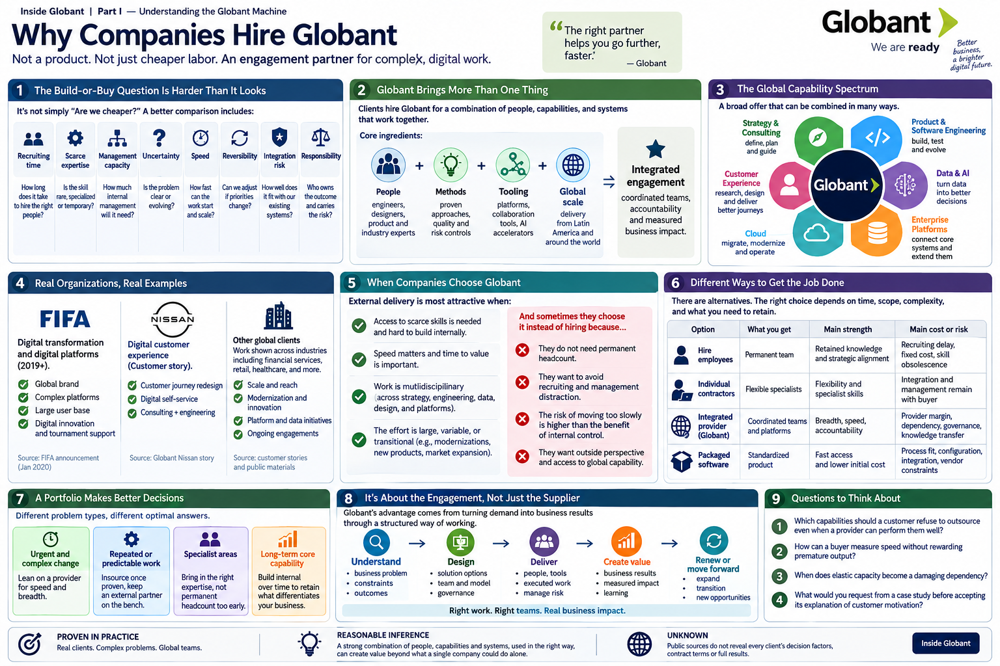

[Inside Globant](../../README.md) · [Part I — Understanding the Globant Machine](README.md)

# Chapter 3 — Why Companies Hire Globant

The build-or-buy question is not “Are employees cheaper than consultants?” A useful comparison includes recruiting time, scarce expertise, management capacity, uncertainty, speed, reversibility, integration risk, and responsibility for a changing program.

## General professional-services economics

The following are **general reasons**, not claims about the motivation of every Globant client:

* **Elastic capacity:** a company can mobilize a team faster than building permanent headcount and later change its size.
* **Scarce specialization:** transformations may briefly require platform migration, data, design, security, and industry expertise in a combination the buyer does not maintain.
* **Execution system:** a provider can supply recruiting, methods, leadership, tooling, quality controls, and distributed operations around the practitioners.
* **Outside perspective:** consultants can compare patterns and challenge an organization, though outsiders also lack local knowledge.
* **Risk and accountability:** a company can assign defined delivery responsibility contractually; it cannot outsource ultimate business ownership.
* **Speed and opportunity cost:** paying a higher apparent day rate may be rational if earlier launch or faster remediation is worth more.

External delivery also creates risks: knowledge leakage, dependency, security exposure, handoff cost, incentives that reward more effort, and loss of internal capability. Globant itself discloses risks around client demand, talent, fixed-price commitments, cybersecurity, concentration, currencies, and global operations ([FY2024 Form 20-F](https://www.sec.gov/edgar/browse/?CIK=1557860&owner=exclude)). A sophisticated buyer compares systems, not hourly rates.

## Documented examples, bounded carefully

Globant and FIFA announced a multiyear partnership covering digital platform work and tournament sponsorship; the announcement documents the relationship and scope at a high level, but not FIFA's procurement calculus or contract economics ([FIFA announcement](https://www.fifa.com/about-fifa/commercial/media-releases/fifa-and-globant-announce-multi-year-partnership)). Nissan's public customer story describes work with Globant on a digital customer experience; it is evidence of described work, not an independent audit of causality ([Globant, Nissan story](https://www.globant.com/customers/nissan)).

These examples support a narrower claim: major organizations publicly use Globant for work tied to important digital channels and experiences. They do not prove that cost, talent access, or speed was the decisive motivation unless the source says so.

## Why not hire?

Hiring is attractive when capability is enduring, strategically differentiating, predictable in volume, and governable internally. External help becomes attractive where need is urgent, variable, multidisciplinary, or transitional. Many enterprises choose a hybrid: employees own product direction, architecture, data stewardship, and institutional knowledge while provider teams contribute capacity and specialist delivery.

The critical boundary is not “core versus non-core” in the abstract. It is **which decisions and knowledge the customer must retain**. A customer can contract for a modernization team; it still must decide the desired operating model, authorize data use, provide domain knowledge, manage organizational change, and judge business value.

| Choice | Strength | Hidden cost |
|---|---|---|
| Hire employees | retained knowledge and alignment | recruiting delay, fixed capacity, skill obsolescence |
| Individual contractors | flexible specialist capacity | integration and management remain with buyer |
| Integrated services provider | coordinated breadth and accountable delivery organization | provider margin, dependency, governance and knowledge-transfer needs |
| Packaged software | fast access to standardized capability | process fit, configuration, integration, vendor constraints |

**Reasonable inference.** Globant's commercial advantage is strongest when a problem requires several of its specialist and geographic capabilities together. **Unknown.** Without a customer's procurement record or testimony, public observers cannot know the rejected alternatives or negotiated trade-offs.

## The make-or-buy decision changes over time

A sensible boundary at the beginning of a transformation may be a poor boundary three years later. During an urgent migration, a provider may contribute scarce architects and a large delivery team. Once the platform stabilizes, the customer may internalize product ownership and operations while retaining the provider for specialist change. Alternatively, a provider that accumulates context may become difficult to replace. Governance should therefore include knowledge transfer, documentation, succession, and an explicit view of which capability the customer intends to own.

Procurement price comparisons can obscure this lifecycle. An employee's salary is not comparable with a provider rate unless recruiting, benefits, management, unassigned time, tooling, and duration are treated consistently. Nor is the provider automatically economical: its sales expense, bench, coordination, and profit are included in price. The right calculation depends on duration, uncertainty, and the economic value of time.

## Risk does not disappear

Contract language reallocates some consequences but does not make a failed program harmless. A fixed price may encourage scope discipline, yet ambiguous requirements can generate change disputes or conservative pricing. Time and materials preserves flexibility, yet requires active prioritization by the customer. The buyer must retain informed product and technical leadership under either form. Hiring Globant is therefore a governance decision as much as a sourcing decision.

## Questions to Think About

1. Which capabilities should a customer refuse to outsource even when a provider can perform them well?
2. How can a buyer measure speed without rewarding premature output?
3. When does elastic capacity become damaging dependency?
4. What would you request from a case study before accepting its explanation of customer motivation?

---

[Previous Chapter](02-what-globant-actually-sells.md) | [Table of Contents](../../CONTENTS.md) | [Next Chapter](04-the-global-delivery-model.md)
