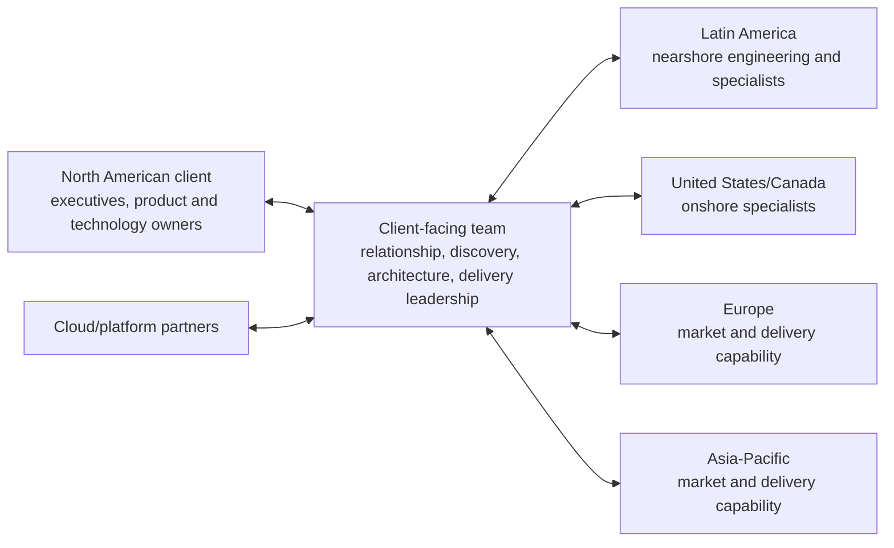

# 4 — The Global Delivery Model

A global delivery model separates where demand is understood from where some or all work is performed. Globant's FY2024 filing describes operations and clients across multiple countries and emphasizes a global, diverse talent base; its locations page provides the current public directory ([FY2024 Form 20-F](https://www.sec.gov/edgar/browse/?CIK=1557860&owner=exclude), [locations](https://www.globant.com/contact)). Because offices can serve sales, administration, delivery, or mixtures, an address alone does not prove a delivery center's role.

## Working vocabulary

* **Onsite:** practitioners work at or closely with the client location.
* **Onshore:** provider work occurs in the client's country.
* **Nearshore:** work occurs in a different but relatively close country, commonly with useful time-zone overlap.
* **Offshore:** work occurs farther away, often enabling different labor pools or follow-the-sun coverage.
* **Distributed delivery:** one engagement is performed across locations; it may combine all of the above.

These terms describe distance, not quality. Nor does “global” mean every project uses every region.

## A conceptual model—not a documented Globant org chart

The diagram expresses possible flows inferred from a global services model. It does **not** assert that Globant staffs every North American account in this way, that each box is a reporting unit, or that all depicted roles participate in every sale.

## Why Latin America matters to North America

Overlap in working hours can make discovery, pairing, reviews, and incident response easier than a schedule with little shared day. Regional talent pools give access beyond a single city's hiring market. Cultural and physical proximity may reduce some friction. Those are potential advantages, not guarantees: language, domain context, turnover, security, and coordination still require management.

Globant is broader than a Latin-America-to-US pipeline. Its disclosed footprint includes the Americas, Europe, and Asia, and acquisitions expanded locations and capabilities. A global portfolio can place expertise closer to customers and diversify talent access, but it increases regulatory, currency, employment, data-transfer, and integration complexity—risks the filing discusses.

## Delivery is a control problem

Distributed teams need more than video calls. They require clear product authority, architecture boundaries, repositories and environments, access control, delivery cadences, escalation routes, quality measures, and knowledge transfer. Client-facing technical professionals are important because context decays across boundaries. Their value is not simply translating English; it is preserving the relationship between business intent and technical decisions.

**Documented fact:** Globant has a multinational footprint and markets global delivery capability. **Reasonable inference:** proximity and specialist routing can be combined differently by engagement. **Unknown:** public sources do not provide an account-level map of which locations serve which customers, staffing ratios, or a universal routing process.

## Designing a location mix

A solution team should not begin with “send everything to the cheapest location.” It should classify work by context intensity, security constraints, specialist scarcity, collaboration cadence, operational coverage, and knowledge-transfer needs. Early discovery or a politically sensitive change may benefit from client proximity. A well-bounded engineering stream may work effectively nearshore. Operations may benefit from distributed coverage. These are general design choices; the actual Globant decision process remains undisclosed.

Location is also dynamic. A small local group can establish context, a larger distributed team can scale implementation, and a later operating team can use a different footprint. That evolution needs continuity: stable leaders, recorded decisions, shared measures, and deliberate transfer. Otherwise every location boundary becomes a place where assumptions multiply.

## Cost is an outcome of the system

Nominal compensation differences are only one component. Rework caused by missing context, travel, attrition, delayed decisions, redundant management, security controls, and unused capacity can erase apparent savings. Conversely, a distributed pool may make a rare capability available quickly and shorten time to value. The economic question is the cost of a reliable outcome, not the cheapest isolated hour. This is why Chapters 4 and 7 belong together.

## Questions to Think About

1. Which kinds of technical work benefit most from time-zone overlap, and which can exploit separated hours?
2. What information is most likely to be lost between a client-facing team and a remote engineering team?
3. Why is an office list an inadequate delivery map?
4. How could a customer test whether “global talent” is operational capability rather than sales language?
