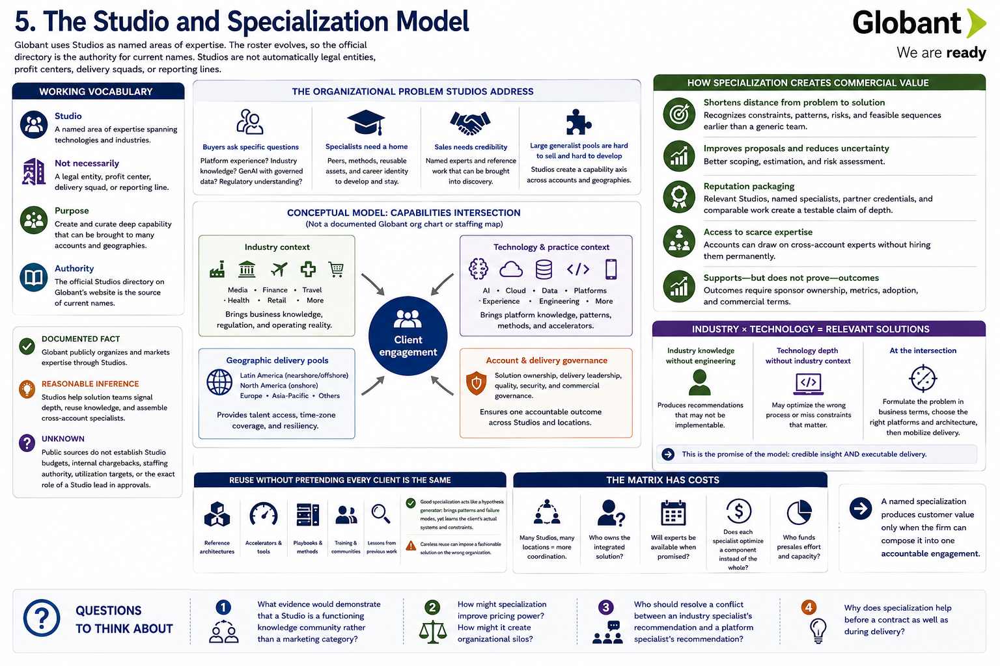
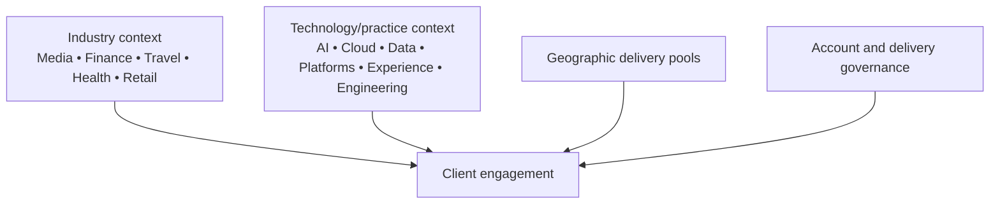

[Inside Globant](../../README.md) · [Part I — Understanding the Globant Machine](README.md)

# Chapter 5 — The Studio and Specialization Model

Globant uses **Studios** as named areas of expertise. The company describes them as deep pockets of specialization spanning technologies and industries; the roster evolves, so the official directory is the authority for current names ([Globant Studios](https://www.globant.com/studios), [FY2024 Form 20-F, business overview](https://www.sec.gov/edgar/browse/?CIK=1557860&owner=exclude)). A Studio should not be casually equated with a legal entity, profit center, delivery squad, or reporting line: public material does not establish that every Studio has all those properties.

## The organizational problem Studios address

A large generalist labor pool is difficult to sell and difficult to develop. Buyers ask specific questions: Have you modernized this platform? Do you understand media rights, banking controls, or airline operations? Can you connect GenAI to governed enterprise data? Specialists need peers, methods, reusable assets, and career identity. Sales teams need credible expertise they can bring into discovery.

Conceptually, Studios create a capability axis across accounts and geographies:

The names in this conceptual diagram summarize categories; they are not a complete current Studio list or an internal staffing schematic.

## How specialization creates commercial value

Specialization reduces the distance between problem language and implementation. A generic developer can implement an API after requirements exist. A credible industry-and-platform team can help discover regulatory constraints, recognize integration patterns, estimate migration risk, and define a feasible sequence. That can improve a proposal and reduce delivery uncertainty.

It also supplies **reputation packaging**. “We have thousands of technologists” is difficult for a buyer to evaluate. A relevant Studio, named specialists, partner credentials, and comparable public work form a more testable claim. During delivery, a Studio may allow an account to find scarce expertise without hiring it permanently into the account team.

This supports—but does not prove—selling outcomes. An outcome requires sponsor ownership, baseline metrics, adoption, and commercial terms, none of which follows automatically from organization by expertise.

## Industry × technology

Industry knowledge without engineering can produce recommendations that cannot be implemented. Technology depth without industry context can optimize the wrong process. The commercial promise of the model lies at their intersection: formulate a problem in business terms, choose suitable platforms and architecture, then mobilize delivery.

**Documented fact:** Globant publicly organizes and markets expertise through Studios. **Reasonable inference:** Studios help solution teams signal depth, reuse knowledge, and assemble cross-account specialists. **Unknown:** the reviewed sources do not establish Studio budgets, internal chargebacks, staffing authority, utilization targets, or the exact role of a Studio lead in approvals.

## Reuse without pretending every client is the same

Services firms seek leverage through reference architectures, accelerators, assessment tools, delivery playbooks, training, and lessons from previous work. A Studio is a plausible home for such knowledge, but public evidence must identify specific assets before this book attributes them to Globant. Reuse can reduce discovery time and risk; careless reuse can impose a fashionable solution on the wrong organization.

Good specialization therefore behaves like a hypothesis generator. An expert arrives able to ask sharper questions and recognize failure modes, yet remains willing to learn the customer's actual systems and constraints. This differs from both a generalist starting without patterns and a product vendor fitting every problem to one product.

## The matrix has costs

An account may need experts from several Studios and locations. That breadth creates coordination and commercial questions: Who owns the integrated solution? Who is available at the promised time? Does each specialist optimize a component rather than the whole? Who funds presales effort? Public material does not answer these internal questions, but they are essential tests of the model. A named specialization produces customer value only when the firm can compose it into one accountable engagement.

## Questions to Think About

1. What evidence would demonstrate that a Studio is a functioning knowledge community rather than a marketing category?
2. How might specialization improve pricing power? How might it create organizational silos?
3. Who should resolve a conflict between an industry specialist's recommendation and a platform specialist's recommendation?
4. Why does specialization help before a contract as well as during delivery?

---

[Previous Chapter](04-the-global-delivery-model.md) | [Table of Contents](../../CONTENTS.md) | [Next Chapter](06-industries-markets-and-customers.md)
