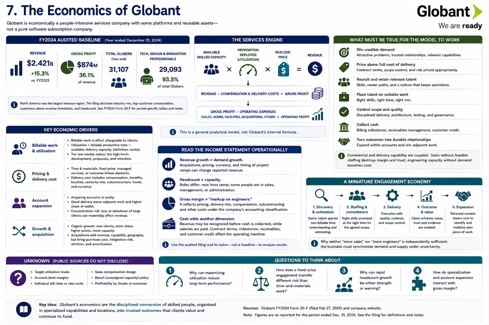

[Inside Globant](../../README.md) · [Part I — Understanding the Globant Machine](README.md)

# Chapter 7 — The Economics of Globant



Globant is economically a people-intensive services company with some platforms and reusable assets—not a pure software subscription company. The FY2024 audited baseline makes the mechanism visible. Globant reported **$2.421 billion of revenue for the year ended December 31, 2024**, up **15.3%** from 2023; gross profit was approximately **$874 million**, or **36.1%** of revenue. It reported **31,107 Globers at year-end**, of whom **29,093** were technology, design, and innovation professionals. These figures and definitions should be read in the filing rather than combined with differently dated website counters ([FY2024 Form 20-F, selected financial and employee data](https://www.sec.gov/edgar/browse/?CIK=1557860&owner=exclude)).

The filing also reports that North America was the largest revenue region and discloses industry mix, top-customer concentration, customers above revenue thresholds, and headcount. Those tables are period-specific. The exact figures are more useful in their original context than detached from currency, acquisition, and classification notes.

## The services engine

```text
available skilled capacity
× proportion deployed on revenue-generating work
× realized price
= revenue

revenue
− compensation and delivery costs
= gross profit

gross profit
− sales, administration, facilities, acquisition and other operating costs
= operating profit
```

This is a **general analytical model**, not Globant's published internal formula. Globant does not publicly disclose every variable required to reproduce an internal utilization or rate card.

### Billable work and utilization

Billable work is effort chargeable under client agreements. Utilization commonly compares billable productive time with available delivery capacity. Low utilization leaves salaries without matching revenue; excessive utilization can starve training, proposals, innovation, and retention. Definitions vary, so a utilization percentage is meaningless without its denominator.

### Pricing and delivery cost

Time-and-materials pricing associates charges with capacity consumed; fixed-price arrangements associate price with agreed scope; managed services may emphasize service levels; an outcome-linked element ties compensation to results. Globant's filing discusses contract forms and revenue recognition, but a public customer story rarely reveals which form applies. Delivery cost includes compensation and related costs; location, seniority mix, scarce skills, subcontractors, travel, and currency can affect it.

### Account expansion

Acquiring an enterprise relationship is expensive. If good delivery earns adjacent work, revenue can grow without recreating trust from zero. Globant reports customer-count and large-account measures because breadth and expansion matter. Concentration is the mirror risk: loss or slowdown of a large client can affect revenue. The filing's concentration disclosures should be treated as observed portfolio metrics, not proof of a particular account-management method.

## Growth and acquisition

Organic growth can come from new clients, greater share of existing accounts, higher prices, or more capacity. Acquisitions can add all four plus geography and specialist credibility, but purchase consideration, integration, attrition, and amortization complicate the economics. The [history chapter](01-from-argentina-to-global-company.md) showed capability-oriented examples; the filing describes acquisition strategy and associated risks.

## What must be true for the model to work?

Globant must repeatedly win credible demand, price it above the full cost of delivery, recruit and retain relevant talent, place that talent on suitable work, control scope and quality, collect cash, and turn outcomes into durable relationships. Commercial and delivery capability are therefore coupled. Sales without feasible staffing destroys margin and trust; engineering capacity without demand becomes cost.

**Unknown:** public evidence does not establish internal target utilization, account-level margins, individual bill rates, sales compensation, bench policy, or profitability by Studio/customer. They should not be reverse-engineered as facts from consolidated results.

## Read the income statement operationally

Revenue growth is not identical to demand growth. Acquisitions, prices, currency, and the timing of project ramps can change reported revenue. Headcount is not identical to capacity: roles differ, new hires ramp, and some people perform sales, management, or administration. Gross margin is not “markup on engineers”; it is a consolidated result of contract pricing, delivery mix, compensation, subcontracting and other costs under the company's accounting classification.

Cash adds another dimension. A provider can recognize revenue before collecting all related cash, while still paying salaries on schedule. Contract terms, billing milestones, receivables, and customer credit therefore affect the operating machine. The audited filing and its notes—not a revenue headline—are the correct place to analyze these relationships.

## A miniature engagement economy

Imagine an account asks for a multidisciplinary team. Before signature, senior people spend non-billable time discovering and estimating. Delivery then needs the promised skills at the promised date. If work starts late, capacity may sit idle; if staffing starts late, milestones and trust suffer. If scope is underestimated under fixed price, extra effort compresses margin. If delivery succeeds, retained context may lower the cost of identifying and mobilizing the next piece of work. This simplified example explains why sales quality, resource management, delivery control, and account expansion are economically connected.

It also shows why neither “more sales” nor “more engineers” is independently sufficient. The business must synchronize demand and supply under uncertainty.

## Questions to Think About

1. Why can maximizing utilization reduce long-term performance?
2. How does a fixed-price engagement transfer different risk than time-and-materials work?
3. Why can rapid headcount growth be either strength or warning?
4. How do specialization and account expansion interact with gross margin?

---

[Previous Chapter](06-industries-markets-and-customers.md) | [Table of Contents](../../CONTENTS.md) | [Next Chapter](08-the-united-states-market.md)
