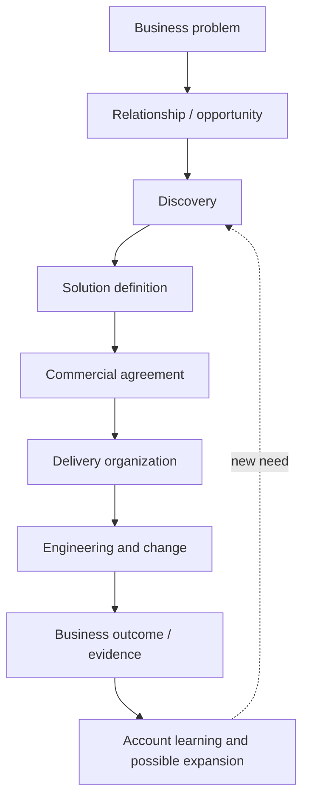

# 9 — The Commercial–Technical–Delivery Chain

Part I can now assemble the mechanism. The model below is a **conceptual services lifecycle**, not a claim that Globant mandates these labels, gates, or sequence on every engagement.

## What evidence supports each link?

| Link | Publicly observable Globant evidence | What remains unknown |
|---|---|---|
| Problem → opportunity | customer stories and announcements name selected ambitions | original trigger, competitors, buyer coalition, qualification |
| Discovery → solution | breadth of consulting, Studio and engineering offers implies these capabilities are available | workshop process, decision rights, presales staffing, artifacts |
| Solution → agreement | filing describes client contracts, pricing/revenue-recognition categories and risks | proposal gates, negotiated rate, liability, exact scope |
| Agreement → delivery | global workforce, locations, Studio descriptions, reported client work | account-level staffing algorithm, location mix, internal handoff |
| Engineering → outcome | selected case studies report outputs and results | baselines, independent attribution, full adoption and long-term value |
| Outcome → expansion | filings report large customers and concentration over time | which outcome caused which follow-on sale and who originated it |

The filing is strong evidence for portfolio economics and contract risks; a customer story is stronger for the described engagement; a job posting can show a role was sought at a time. None provides the whole chain.

## Who connects customer and engineering?

Functions, rather than presumed Globant titles, clarify the work:

* **Business development/sales** creates and qualifies access to demand.
* **Account management** maintains context, trust, commercial health, and opportunity continuity.
* **Consulting** frames the business problem, choices, operating implications, and change.
* **Solution architecture/technical specialists** test feasibility, define the technical approach, expose dependencies, and estimate work.
* **Delivery leadership** converts commitments into teams, plans, governance, risk management, and escalation.
* **Engineers and designers** discover details and create the actual system and experience.
* **Partners** contribute platforms, expertise, incentives, and sometimes market access.

These are standard descriptions of functions. Globant's Studios, service pages, leadership materials, and vacancies make several functions publicly observable, but the evidence reviewed does not justify forcing them into a SaaS-style “account executive + sales engineer” pairing. A services solution changes during discovery and continues to change in delivery; the boundary between presales and delivery may therefore be more porous.

## The handoff fallacy

The diagram looks sequential, but discovery continues after contract signature. Architecture changes as legacy facts emerge. Commercial choices shape technical risk; technical constraints reshape value. Treating the process as a one-way handoff invites three failures:

1. sales promises a team or outcome delivery cannot support;
2. engineering optimizes a technically interesting solution detached from sponsor value;
3. account expansion becomes opportunistic selling rather than learned response to a new need.

A strong connector preserves traceability from objective to architecture to backlog to measure. That person need not be one individual. At Globant's scale it is more plausibly a coalition—but that is a **reasonable inference**, not a disclosed universal structure.

## An evidence agenda for later parts

To move beyond the conceptual model, Part II will triangulate joint customer announcements, customer testimony, partner material, named leaders, case pages, and dated filings. We will ask who spoke for the business problem, what was actually built, where delivery evidence exists, which outcome was measured, and what remains private.

## Controls at the seams

Each arrow needs an artifact or decision. A problem can become an opportunity through an agreed problem statement and sponsor. Discovery can become a solution through assumptions, architecture, delivery plan, dependencies, measures, and an estimate. A solution becomes an agreement through scope, responsibilities, acceptance, price, change control, and risk terms. Delivery becomes evidence through working systems, adoption, operational measures, and customer judgment.

These examples are a normative checklist, not a disclosure of Globant templates. They show what later customer research should look for. When an announcement jumps from “transformation” to “partnership,” the missing artifacts should remain missing rather than supplied by imagination.

## Partners can enter more than once

A technology partner may introduce an opportunity, supply platform specialists during discovery, validate architecture, provide funding or credits, and support delivery escalation. It may also constrain the solution toward its platform. A provider must translate partner capability into customer value without treating partner status as proof that one architecture is correct. Public partner profiles establish ecosystem membership; opportunity-level influence is usually unknown.

## Expansion closes the learning loop

Expansion should not be interpreted solely as selling more people. Delivery reveals adjacent process problems, obsolete systems, data gaps, and organizational constraints. A trustworthy account team converts those observations into hypotheses, then allows the customer to decide whether another engagement has value. Economically this may deepen the account; ethically and operationally it must remain grounded in customer need.

## Questions to Think About

1. Which lifecycle links can a public case study establish most reliably?
2. Where should solution architects' responsibility end after a contract is signed?
3. What commercial information does delivery need, and what technical information does sales need?
4. How could incentives prevent account expansion from undermining customer value?
5. Why is “unknown” a useful finding when reconstructing a services engagement?
