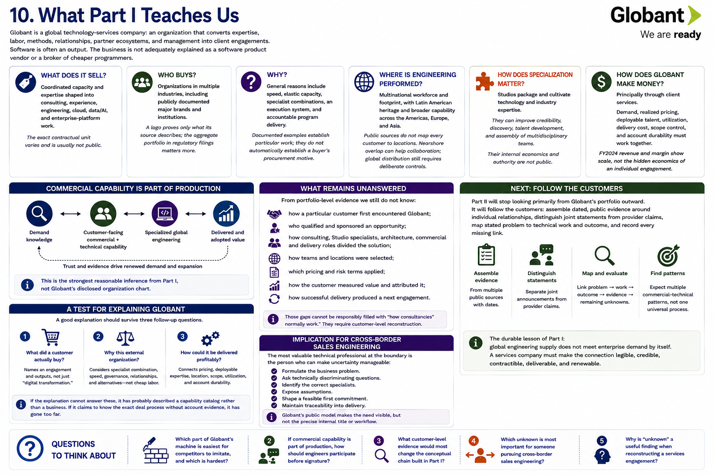
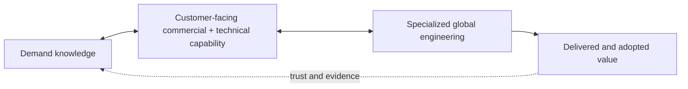

[Inside Globant](../../README.md) · [Part I — Understanding the Globant Machine](README.md)

# Chapter 10 — What Part I Teaches Us

Globant is a global technology-services company: an organization that converts expertise, labor, methods, relationships, partner ecosystems, and management into client engagements. Software is often an output. The business is not adequately explained as a software product vendor or a broker of cheaper programmers.

## The answer in one page

**What does it sell?** Coordinated capacity and expertise shaped into consulting, experience, engineering, cloud, data/AI, and enterprise-platform work. The exact contractual unit varies and is usually not public.

**Who buys?** Organizations in multiple industries, including publicly documented major brands and institutions. A logo proves only what its source describes; the aggregate portfolio in regulatory filings matters more than an anecdotal list.

**Why?** General reasons include speed, elastic capacity, specialist combinations, an execution system, and accountable program delivery. Documented examples establish particular work; they do not automatically establish a buyer's procurement motive. Hiring remains preferable for enduring capabilities and knowledge the enterprise must own.

**Where is engineering performed?** Globant has a multinational workforce and footprint, with Latin American heritage and broader capability across the Americas, Europe, and Asia. Public sources do not map every customer to locations. Nearshore overlap can help collaboration; global distribution still requires deliberate controls.

**How does specialization matter?** Studios package and cultivate technology and industry expertise. They can improve credibility, discovery, talent development, and assembly of multidisciplinary teams. Their internal economics and authority are not public.

**How does Globant make money?** Principally through client services. Demand, realized pricing, deployable talent, utilization, delivery cost, scope control, and account durability must work together. FY2024 revenue and margin show scale, not the hidden economics of an individual engagement.

## Commercial capability is part of production

Engineering capability has no economic value to Globant while it is disconnected from qualified demand. Commercial capability without technical truth produces unstaffable promises and damaged accounts. The connective tissue—relationship building, discovery, consulting, architecture, solution definition, contracting, and delivery governance—is therefore not overhead in the colloquial sense. It is part of the production system that turns distributed expertise into client value.

The diagram is the strongest **reasonable inference** from Part I, not Globant's disclosed organization chart.

## What remains unanswered

We still do not know from portfolio-level evidence:

* how a particular customer first encountered Globant;
* who qualified and sponsored an opportunity;
* how consulting, Studio specialists, architecture, commercial and delivery roles divided the solution;
* how teams and locations were selected;
* which pricing and risk terms applied;
* how the customer measured value and attributed it;
* how successful delivery produced a next engagement.

Those gaps cannot be responsibly filled with “how consultancies normally work.” They require customer-level reconstruction.

## Next: FOLLOW THE CUSTOMERS

Part II will stop looking primarily from Globant's portfolio outward. It will **follow the customers**: assemble dated, public evidence around individual relationships, distinguish joint statements from provider claims, map stated problem to technical work and outcome, and record every missing link. That method may reveal several commercial–technical patterns rather than one universal Globant process.

The durable lesson of Part I is simple but demanding: global engineering supply does not meet enterprise demand by itself. A services company must make the connection legible, credible, contractible, deliverable, and renewable.

## A test for explaining Globant

A good explanation should survive three follow-up questions. First, “What did a customer actually buy?” The answer names an engagement and outputs rather than repeating “digital transformation.” Second, “Why this external organization?” The answer considers specialist combination, speed, governance, relationships, and alternatives rather than assuming cheap labor. Third, “How could it be delivered profitably?” The answer connects pricing, deployable expertise, location, scope, utilization, and account durability.

If the explanation cannot answer these, it has probably described a capability catalog rather than a business. If it claims to know the exact deal process, staffing, or motivation without account evidence, it has gone too far.

## Implication for cross-border sales engineering

The most valuable technical professional at the boundary is not the person who can mention the most technologies. It is the person who can make uncertainty manageable: formulate the business problem, ask technically discriminating questions, identify the correct specialists, expose assumptions, shape a feasible first commitment, and maintain traceability into delivery. That work protects both the customer and the engineering organization.

Globant's public model makes the need visible, but not the precise internal title or workflow. That final distinction is itself a lesson. Studying a real company requires learning from what is observable while refusing to turn a plausible industry pattern into a company fact.

## Questions to Think About

1. Which part of Globant's machine is easiest for competitors to imitate, and which is hardest?
2. If commercial capability is part of production, how should engineers participate before signature?
3. What customer-level evidence would most change the conceptual chain built in Part I?
4. Which unknown is most important for someone pursuing cross-border sales engineering?

---

[Previous Chapter](09-the-commercial-technical-delivery-chain.md) | [Table of Contents](../../CONTENTS.md) | [Next Chapter](../part-2-customers/11-follow-the-customers.md)
