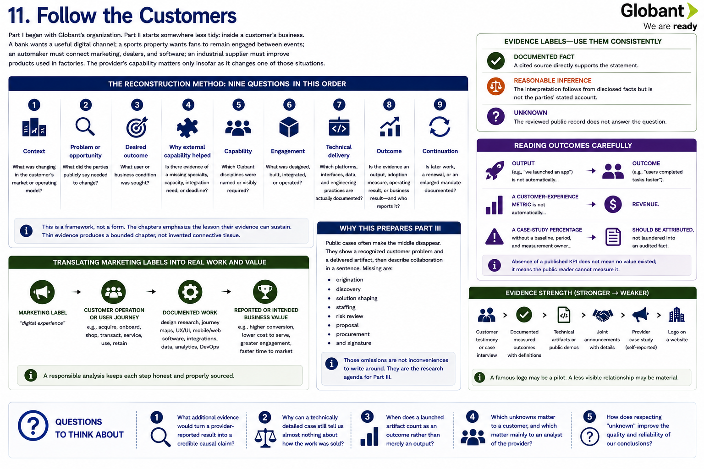

[Inside Globant](../../README.md) · [Part II — Follow the Customers](README.md) · [Customer Index](../../appendix/customer-index.md)

# Chapter 11 — Follow the Customers



Part I began with Globant's organization. Part II starts somewhere less tidy: inside a customer's business. A bank wants a useful digital channel; a sports property wants fans to remain engaged between events; an automaker must connect marketing, dealers, and software; an industrial supplier must improve products used in factories. The provider's capability matters only insofar as it changes one of those situations.

Customer evidence reveals combinations that an offering page cannot. A service called “digital experience” might mean designing a journey, writing mobile software, connecting identity and payment systems, instrumenting behavior, or operating a release process. A named case can expose some of that chain. It rarely exposes the commercial negotiation.

## The reconstruction method

Each case asks nine questions, in an order intended to resist provider-first storytelling:

1. **Context:** what was changing in the customer's market or operating model?
2. **Problem or opportunity:** what did the parties publicly say needed to change?
3. **Desired outcome:** what user or business condition was sought?
4. **Why external capability helped:** is there evidence of a missing specialty, capacity, integration need, or deadline?
5. **Capability:** which Globant disciplines were named or visibly required?
6. **Engagement:** what was designed, built, integrated, or operated?
7. **Technical delivery:** which platforms, interfaces, data, and engineering practices are actually documented?
8. **Outcome:** is the evidence an output, adoption measure, operating result, or business result—and who reports it?
9. **Continuation:** is later work, a renewal, or an enlarged mandate documented?

This is a framework, not a form. The chapters emphasize the lesson their evidence can sustain. Thin evidence produces a bounded chapter, not invented connective tissue.

## Three evidence labels

> **Documented fact** means a cited source directly supports the statement. **Reasonable inference** means the interpretation follows from disclosed facts but is not the parties' stated account. **Unknown** means the reviewed public record does not answer the question.

A provider case study is evidence that Globant publicly represented the work and outcome; it is not independent verification. A customer release is stronger for the customer's intent. A joint announcement proves that both parties chose to announce a relationship, but not that every aspiration was delivered. A dated sequence can support continuation; a logo cannot.

The strongest account-level evidence would join customer intent, technical artifacts, measured outcomes with definitions, and repeat evidence. None of the cases supplies every element. Consequently this Part does not estimate contract value, margin, team size, procurement path, pricing, competitors, salesperson, or delivery geography unless a source states it.

## Reading outcomes carefully

An output (“we launched an app”) is not automatically an outcome (“users completed tasks faster”). A customer-experience metric is not automatically revenue. A case-study percentage without a baseline, period, and measurement owner should be attributed, not laundered into an audited fact. Conversely, absence of a published KPI does not mean no value existed; it means the public reader cannot measure it.

The analysis therefore translates cautiously:

```text
marketing label
  → customer operation or user journey
  → documented software, design, data, or integration work
  → reported or intended business value
```

## Why this prepares Part III

Public cases often make the middle disappear. They show a recognized customer problem and a delivered artifact, then describe collaboration in a sentence. Missing are origination, discovery, solution shaping, staffing, risk review, proposal, procurement, and signature. Those omissions are not inconveniences to write around. They are the research agenda for Part III.

## Questions to Think About

1. What additional evidence would turn a provider-reported result into a credible causal claim?
2. Why can a technically detailed case still tell us almost nothing about how the work was sold?
3. When does a launched artifact count as an outcome rather than merely an output?
4. Which unknowns matter to a customer, and which matter mainly to an analyst of the provider?

---

[Previous Chapter](../part-1-understanding-globant/10-what-part-i-teaches-us.md) | [Table of Contents](../../CONTENTS.md) | [Next Chapter](12-google.md)
