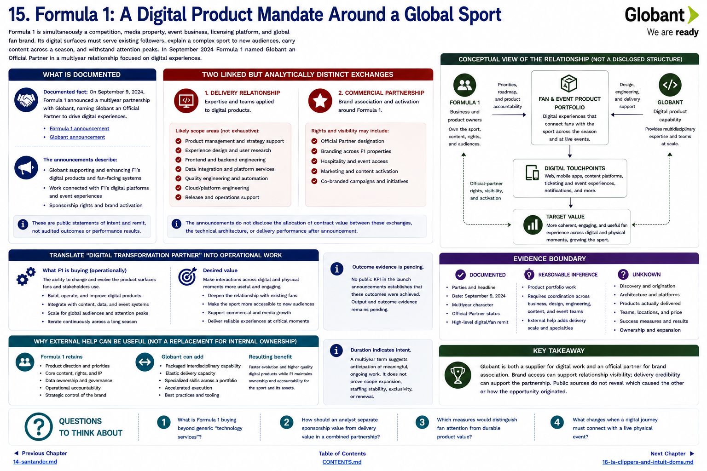
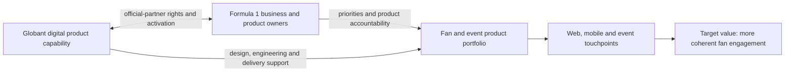

[Inside Globant](../../README.md) · [Part II — Follow the Customers](README.md) · [Customer Index](../../appendix/customer-index.md)

# Chapter 15 — Formula 1: A Digital Product Mandate Around a Global Sport

Formula 1 is simultaneously a competition, media property, event business, licensing platform, and global fan brand. Its digital surfaces must serve existing followers, explain a complex sport to new audiences, carry content across a season, and withstand attention peaks. In September 2024 Formula 1 named Globant an Official Partner in a multiyear relationship focused on digital experiences ([Formula 1 announcement](https://www.formula1.com/en/latest/article/formula-1-announces-globant-as-an-official-partner-to-drive-digital.4pUzE5QpdthT1DRdqS1Dlw), [Globant announcement](https://www.globant.com/news/formula-1-and-globant-announce-multi-year-partnership)).

## What Formula 1 said it was buying

The announcements describe a remit to support and enhance F1's digital products and fan-facing systems, including work connected with F1's digital platforms and event experiences. They also describe sponsorship rights. Those are two linked but analytically distinct exchanges:

* **delivery relationship:** expertise and teams applied to digital products;
* **commercial partnership:** brand association and activation around Formula 1.

Neither announcement discloses the allocation of contract value between them, the technical architecture, or delivery performance after announcement. At publication, several statements are forward-looking intentions rather than measured outcomes.

*The parties and high-level remit are documented; the arrows are a conceptual reading of the announcements, not a disclosed governance chart.*

## Translate “digital transformation partner”

At operational level, Formula 1 is not buying an abstract transformation. It is buying the ability to change product surfaces used by fans and participants. That can require product management, experience design, frontend and backend engineering, data integration, quality engineering, cloud/platform work, and release operations. The releases support a multidisciplinary digital remit, but do not enumerate who supplied every role or platform.

The desired value is similarly concrete: make interactions across digital and physical moments more useful and engaging, extend the relationship with a fan beyond the television broadcast, and evolve products as the sport grows. No public KPI in the launch announcement establishes that those outcomes were achieved. **Output and outcome evidence remains pending.**

## Why external help can be useful

A sports-rights owner has permanent internal knowledge of the competition, content, rights, and audience. An external engineering firm can add delivery scale and specialties across a portfolio without taking ownership of the sport. The multiyear term suggests the parties anticipated more than a short build. It does not prove scope expansion, staffing stability, exclusivity, or renewal.

This case also shows why the word “customer” can underdescribe a relationship. Globant is both a supplier associated with digital work and a sponsor/official partner. Brand access may support relationship visibility; delivery credibility may support the partnership. Public sources do not reveal which caused the other or how the opportunity originated.

## Evidence boundary

**Documented:** parties, announcement date, multiyear character, official-partner status, and high-level digital/fan remit. **Reasonable inference:** product portfolio work requires coordination among business, design, engineering, content, and event stakeholders. **Unknown:** discovery, competing bidders, exact products delivered, architecture, team/geography, price, success measures, operational ownership, and expansion.

## Questions to Think About

1. What is Formula 1 buying beyond “technology services”?
2. How should an analyst separate sponsorship value from delivery value in a combined partnership?
3. Which measures would distinguish fan attention from durable product value?
4. What changes when a digital journey must connect with a live physical event?

---

[Previous Chapter](14-santander.md) | [Table of Contents](../../CONTENTS.md) | [Next Chapter](16-la-clippers-and-intuit-dome.md)
