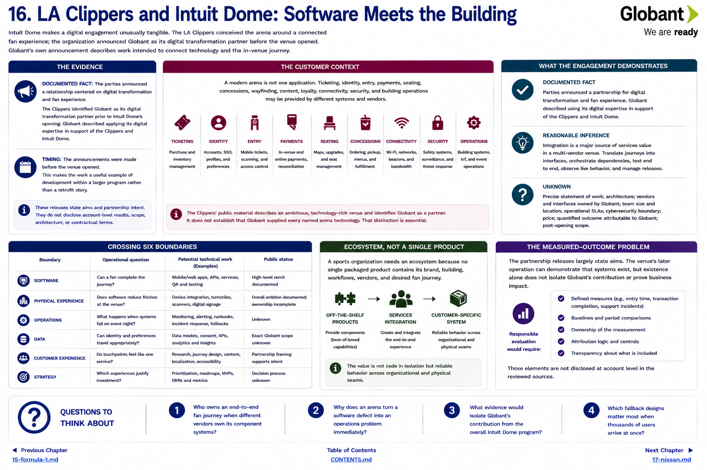

[Inside Globant](../../README.md) · [Part II — Follow the Customers](README.md) · [Customer Index](../../appendix/customer-index.md)

# Chapter 16 — LA Clippers and Intuit Dome: Software Meets the Building

Intuit Dome makes a digital engagement unusually tangible. The LA Clippers conceived the arena around a connected fan experience; the organization announced Globant as its digital transformation partner before the venue opened ([LA Clippers announcement](https://www.nba.com/clippers/news/la-clippers-announce-globant-as-digital-transformation-partner), [Intuit Dome](https://www.intuitdome.com/)). Globant's own announcement describes work intended to connect technology and the in-venue journey ([Globant announcement](https://www.globant.com/news/globant-and-la-clippers-announce-digital-transformation-partnership)).

## The customer context

A modern arena is not one application. Ticketing, identity, entry, payments, seating, concessions, wayfinding, content, loyalty, connectivity, security, and building operations may be provided by different systems and vendors. A fan experiences the seams: a failed identity match or slow entry is a physical queue, not merely an API error.

The Clippers' public material describes an ambitious, technology-rich venue and identifies Globant as a partner. It does not establish that Globant supplied every named arena technology. That distinction is essential because venue announcements often describe the whole experience alongside multiple specialist partners.

## What the engagement demonstrates

**Documented fact:** the parties announced a relationship centered on digital transformation and fan experience. Globant described using its digital expertise in support of the Clippers and Intuit Dome. The relationship evidence predates the building's public opening, making the work a useful example of development within a larger program rather than a retrofit story.

**Reasonable inference:** integration is a major source of services value in a multi-vendor venue. Someone must translate desired journeys into interfaces, orchestrate dependencies, test end to end, observe live behavior, and manage releases. This does not establish that Globant was the sole integrator or operated any particular system.

**Unknown:** precise statement of work; architecture; vendors and interfaces owned by Globant; team size and location; operational service levels; cybersecurity boundary; price; quantified outcome attributable to Globant; and post-opening scope.

## Crossing six boundaries

| Boundary | Operational question | Potential technical work | Public status |
|---|---|---|---|
| software | can a fan complete the journey? | mobile/web services and testing | high-level remit documented |
| physical experience | does software reduce friction at the venue? | device/entry/interface integration | overall ambition documented; ownership incomplete |
| operations | what happens when systems fail on event night? | monitoring, fallbacks, support runbooks | unknown |
| data | can identity and preferences travel appropriately? | models, consent, APIs, analytics | exact Globant scope unknown |
| customer experience | do touchpoints feel like one service? | research, journey design, accessibility | partnership framing supports intent |
| strategy | which experiences justify investment? | prioritization and product roadmap | decision process unknown |

A sports organization needs an ecosystem because no single packaged product contains its brand, building, workflows, vendors, and desired fan journey. Off-the-shelf products can supply components; services create and integrate the customer-specific system. The value is not code in isolation but reliable behavior across organizational and physical seams.

## The measured-outcome problem

The partnership releases largely state aims. The venue's later operation can demonstrate that systems exist, but existence alone does not isolate Globant's contribution or prove business impact. Responsible evaluation would require defined measures—entry time, transaction completion, support incidents, adoption, satisfaction, or repeat attendance—with baselines and ownership. Those are not disclosed at account level in the reviewed sources.

## Questions to Think About

1. Who owns an end-to-end fan journey when different vendors own its component systems?
2. Why does an arena turn a software defect into an operations problem immediately?
3. What evidence would isolate Globant's contribution from the overall Intuit Dome program?
4. Which fallback designs matter most when thousands of users arrive at once?

---

[Previous Chapter](15-formula-1.md) | [Table of Contents](../../CONTENTS.md) | [Next Chapter](17-nissan.md)
