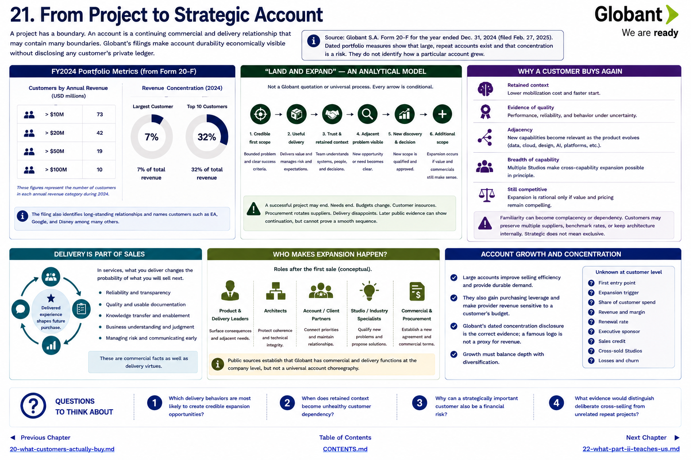

[Inside Globant](../../README.md) · [Part II — Follow the Customers](README.md) · [Customer Index](../../appendix/customer-index.md)

# Chapter 21 — From Project to Strategic Account



A project has a boundary. An account is a continuing commercial and delivery relationship that may contain many boundaries. Globant's filings make account durability economically visible without disclosing any customer's private ledger.

For the year ended **December 31, 2024**, Globant reported customer counts at several annual-revenue thresholds and concentration for its largest and top-ten customers. The filing also describes long-standing relationships and identifies customers such as EA, Google, and Disney ([FY2024 Form 20-F](https://www.sec.gov/edgar/browse/?CIK=1557860&owner=exclude)). Those dated portfolio measures show that large repeat accounts exist and that concentration is a risk. They do not identify how a particular account grew.

## “Land and expand” is an analytical model

In professional services, *land and expand* means beginning with bounded work and earning additional work in an account. It is a general industry concept, not presented here as a Globant quotation or universal process.

```text
credible first scope → useful delivery → trust and retained context
→ adjacent problem becomes visible → new discovery and decision
→ additional scope (if value and commercials still make sense)
```

Every arrow is conditional. A successful project may end because the need ends, budgets change, a customer insources, procurement rotates suppliers, or delivery disappoints. Later public evidence can indicate continuation, but cannot reveal a smooth sequence unless the parties describe it.

## Why a customer buys again

A delivered team now understands systems, stakeholders, controls, and decision rhythms. That context can reduce mobilization cost. Good delivery also gives the buyer evidence about quality and behavior under uncertainty. Adjacent capabilities—data, cloud, design, AI, enterprise platforms—may become relevant as the product evolves. Globant's Studio breadth makes cross-capability expansion possible in principle; no public evidence proves that every Studio participates in cross-selling.

Expansion is economically rational only if the next work remains competitive. Familiarity can become complacency or dependency. Customers may preserve multiple suppliers, benchmark rates, or retain architecture internally. Strategic does not mean exclusive.

## Delivery is part of sales

This is a conceptual lesson, not an undocumented Globant slogan. In services, the delivered experience changes the probability of future purchase. Reliability, transparent risk management, quality, usable documentation, knowledge transfer, and business understanding are therefore commercial facts as well as delivery virtues.

Roles after the first sale matter: product and delivery leaders surface consequences and adjacent needs; architects protect coherence; account or client partners connect stakeholder priorities; Studio or industry specialists may qualify a new problem; commercial and procurement functions establish a new agreement. Public sources establish that Globant has commercial and delivery functions at company level, but not a universal account choreography.

## Account growth and concentration

Large accounts can improve selling efficiency and provide durable demand. They can also gain purchasing leverage and make provider revenue sensitive to a customer's budget. Globant's dated concentration disclosure is the correct evidence; a famous logo is not a proxy for revenue. Growth must therefore balance depth with diversification.

**Unknown at customer level:** first entry point, expansion trigger, share of customer spend, revenue, margin, renewal rate, executive sponsor, sales credit, cross-sold Studios, and losses. These unknowns are central to Part III.

## Questions to Think About

1. Which delivery behaviors are most likely to create credible expansion opportunities?
2. When does retained context become unhealthy customer dependency?
3. Why can a strategically important customer also be a financial risk?
4. What evidence would distinguish deliberate cross-selling from unrelated repeat projects?

---

[Previous Chapter](20-what-customers-actually-buy.md) | [Table of Contents](../../CONTENTS.md) | [Next Chapter](22-what-part-ii-teaches-us.md)
