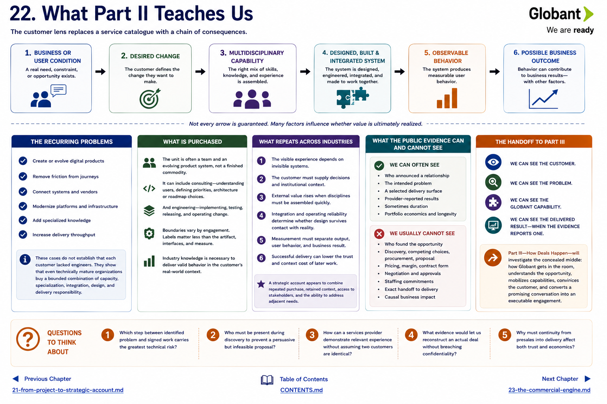

[Inside Globant](../../README.md) · [Part II — Follow the Customers](README.md) · [Customer Index](../../appendix/customer-index.md)

# Chapter 22 — What Part II Teaches Us



The customer lens replaces a service catalogue with a chain of consequences.

```text
business or user condition
→ desired change
→ multidisciplinary capability
→ designed, built and integrated system
→ observable behavior
→ possible business outcome
```

## The recurring problems

Customers seek to create or evolve digital products, remove friction from journeys, connect systems and vendors, modernize platforms, add specialized knowledge, and increase delivery throughput. Sports properties want relationships extending beyond the event; a bank needs useful channels inside strict controls; an automaker joins digital intent to a distributed commercial system; an arena makes software part of a physical operation; a game publisher repeatedly supplements a sophisticated production organization.

The cases do **not** establish that each customer lacked engineers. They instead support a more precise proposition: even technically mature organizations can purchase a bounded combination of capacity, specialization, integration, design, and delivery responsibility.

## What is purchased

The unit is often a team and an evolving product system, not a finished commodity. It can include consulting—understanding users, defining priorities, making architecture or roadmap choices—and engineering—implementing, testing, releasing, and operating change. The boundary varies. Public marketing labels are less informative than the named artifact, system interfaces, and measure.

These engagements are technically substantive when customer behavior depends on software and integration. Industry knowledge is necessary because requirements live in bank controls, dealer channels, game pipelines, media rights, event operations, or factory workflows. Domain fluency does not replace engineering; it directs engineering toward valid behavior.

## What repeats across industries

1. The visible experience depends on invisible systems.
2. The customer must supply decisions and institutional context.
3. External value rises when disciplines must be assembled quickly.
4. Integration and operating reliability determine whether design survives contact with reality.
5. Measurement must separate output, user behavior, and business result.
6. Successful delivery can lower the trust and context cost of later work.

A strategic account appears to combine repeated purchase, retained context, access to stakeholders, and the ability to address adjacent needs. Duration and portfolio account metrics support the existence of such relationships. They do not reveal the playbook or prove that every long relationship expanded.

## What the public evidence can and cannot see

We can often see who announced a relationship, the intended problem, a selected delivery surface, provider-reported results, and sometimes duration. Formula 1 and FIFA announcements are good evidence of intent and term. Globant case studies can add delivery and outcome detail. Filings show portfolio economics and longevity.

We usually cannot see who found the opportunity, who performed discovery, the competing choices, procurement, proposal, solution approvals, staffing commitments, price, margin, contract form, negotiation, or the exact handoff to delivery. Nor can a polished case establish causal impact by itself. These are not minor footnotes; they are the missing commercial mechanism.

## The handoff to Part III

> **WE CAN SEE THE CUSTOMER.**  
> **WE CAN SEE THE PROBLEM.**  
> **WE CAN SEE THE GLOBANT CAPABILITY.**  
> **WE CAN SEE THE DELIVERED RESULT—WHEN THE EVIDENCE REPORTS ONE.**

But what happens between “this company has a problem” and “Globant has a signed engagement to solve it”?

Someone must gain access, recognize and qualify the problem, earn enough trust for discovery, assemble industry and technical perspectives, define a feasible solution, estimate and staff it, address risk and procurement, negotiate commercials, and preserve continuity into delivery. Part II can infer that these functions must exist. It cannot assign people or sequence to them from customer stories.

Part III—**How Deals Happen**—will investigate that concealed middle: how Globant gets into the room, understands the opportunity, mobilizes the right capabilities, convinces the customer, and converts a promising conversation into an executable engagement.

## Questions to Think About

1. Which step between identified problem and signed work carries the greatest technical risk?
2. Who must be present during discovery to prevent a persuasive but infeasible proposal?
3. How can a services provider demonstrate relevant experience without assuming two customers are identical?
4. What evidence would let us reconstruct an actual deal without breaching confidentiality?
5. Why must continuity from presales into delivery affect both trust and economics?

---

[Previous Chapter](21-from-project-to-strategic-account.md) | [Table of Contents](../../CONTENTS.md) | [Next Chapter](../part-3-how-deals-happen/23-the-commercial-engine.md)
