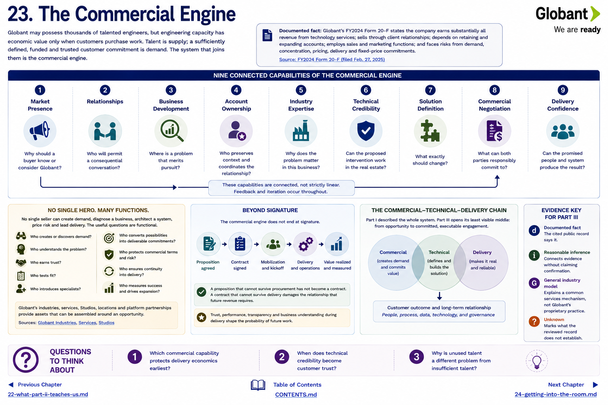

[Inside Globant](../../README.md) · [Part III — How Deals Happen](README.md)

# Chapter 23 — The Commercial Engine

Globant may possess thousands of talented engineers, but engineering capacity has economic value only when customers purchase work. Talent is supply; a sufficiently defined, funded and trusted customer commitment is demand. The system that joins them is the **commercial engine**.

Globant's FY2024 filing provides the outside boundaries: the company earns substantially all revenue from technology services, sells through client relationships, depends on retaining and expanding accounts, employs sales and marketing functions, and carries risks from demand, concentration, pricing, delivery and fixed-price commitments ([FY2024 Form 20-F](https://www.sec.gov/edgar/browse/?CIK=1557860&owner=exclude)). It does not publish a universal funnel, stage vocabulary, approval chain or commission plan.

## Nine connected capabilities

| Capability | Commercial question |
|---|---|
| market presence | Why should a buyer know or consider Globant? |
| relationships | Who will permit a consequential conversation? |
| business development | Where is a problem that merits pursuit? |
| account ownership | Who preserves context and coordinates the relationship? |
| industry expertise | Why does the problem matter in this business? |
| technical credibility | Can the proposed intervention work in the real estate? |
| solution definition | What exactly should change? |
| commercial negotiation | What can both parties responsibly commit to? |
| delivery confidence | Can the promised people and system produce the result? |

**Documented fact:** Globant publicly combines industries, services, Studios, locations, customers and platform partnerships ([industries](https://www.globant.com/industries), [services](https://www.globant.com/services), [Studios](https://www.globant.com/studios)). **Reasonable inference:** those assets can be assembled around an opportunity. **Unknown:** whether every opportunity follows the same sequence or which role owns each decision.

No single heroic seller need create demand, diagnose a business, architect a system, price risk and lead delivery. The useful questions are functional: Who creates or discovers demand? Who understands the problem? Who earns trust? Who tests fit? Who introduces specialists? Who converts possibilities into deliverable commitments? The chapters ahead trace these functions without turning an outside reconstruction into an alleged Globant method.

The commercial engine therefore does not end at signature. A proposition that cannot survive procurement has not become a contract; a contract that cannot survive delivery damages the relationship that future revenue requires. [Part I's commercial–technical–delivery chain](../part-1-understanding-globant/09-the-commercial-technical-delivery-chain.md) described the whole system. Part III opens its least visible middle.

## Evidence key for Part III

* **Documented fact** means the cited public record says it.
* **Reasonable inference** connects evidence without claiming confirmation.
* **General industry model** explains a common services mechanism, not Globant's proprietary practice.
* **Unknown** marks what the reviewed record does not establish.

## Questions to Think About

1. Which commercial capability protects delivery economics earliest?
2. When does technical credibility become customer trust?
3. Why is unused talent a different problem from insufficient talent?

---

[Previous Chapter](../part-2-customers/22-what-part-ii-teaches-us.md) | [Table of Contents](../../CONTENTS.md) | [Next Chapter](24-getting-into-the-room.md)
