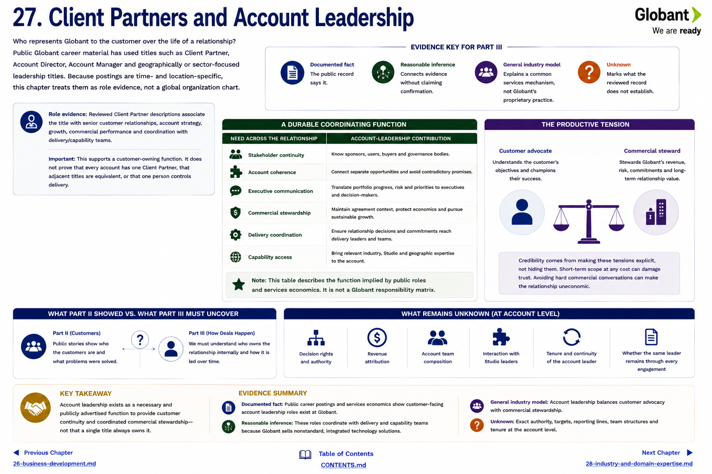

[Inside Globant](../../README.md) · [Part III — How Deals Happen](README.md)

# Chapter 27 — Client Partners and Account Leadership

Who represents Globant to the customer over the life of a relationship? Public Globant career material has used titles such as **Client Partner**, **Account Director**, **Account Manager** and geographically or sector-focused leadership titles ([Globant careers](https://career.globant.com/)). Because postings are time- and location-specific, this chapter treats them as role evidence, not a global organization chart.

Reviewed Client Partner descriptions associated the title with senior customer relationships, account strategy, growth, commercial performance and coordination with delivery/capability teams. That supports a customer-owning function. It does not prove that every account has one Client Partner, that adjacent titles are equivalent, or that one person controls delivery.

## A durable coordinating function

| Need across the relationship | Account-leadership contribution |
|---|---|
| stakeholder continuity | know sponsors, users, buyers and governance bodies |
| account coherence | connect separate opportunities and avoid contradictory promises |
| executive communication | translate portfolio progress, risk and priorities |
| commercial stewardship | maintain agreement context and pursue sustainable growth |
| delivery coordination | ensure relationship decisions reach delivery leaders |
| capability access | bring relevant industry, Studio and geographic expertise |

This table describes the **function** implied by public roles and services economics. It is not a Globant responsibility matrix.

Account leadership occupies a productive tension. The customer needs an advocate who understands its objectives; Globant needs a steward of revenue, risk and feasible commitments. Purely maximizing near-term scope could damage trust. Purely avoiding difficult commercial conversations could make the relationship uneconomic. Credibility comes from making those tensions explicit.

[Part II](../part-2-customers/22-what-part-ii-teaches-us.md) showed public relationships but rarely their internal owner. **Unknown:** decision rights, revenue attribution, account-team composition, interaction with Studio leaders, and whether the same leader remains through every engagement. The safe conclusion is that customer continuity and coordinated commercial stewardship exist as necessary and publicly advertised functions—not that a single title always owns them.

## Questions to Think About

1. When should account ownership and delivery ownership be separate?
2. What information must persist when an account leader changes?
3. How can growth responsibility improve rather than distort customer advice?

---

[Previous Chapter](26-business-development.md) | [Table of Contents](../../CONTENTS.md) | [Next Chapter](28-industry-and-domain-expertise.md)
