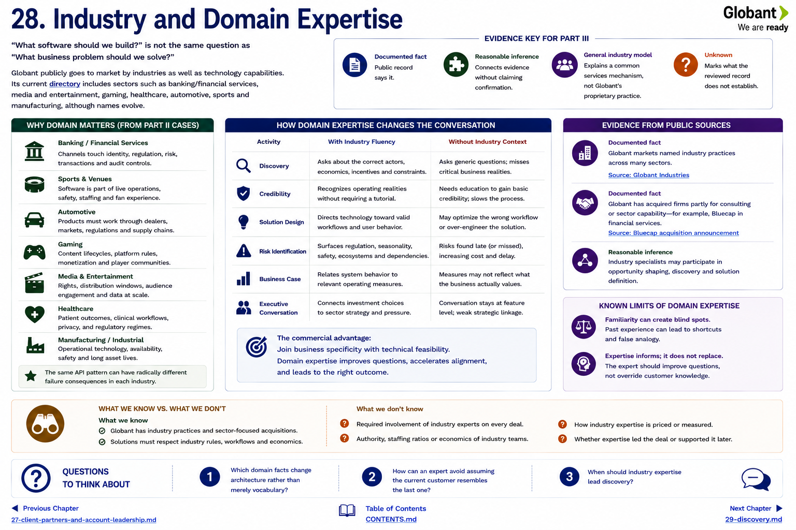

[Inside Globant](../../README.md) · [Part III — How Deals Happen](README.md)

# Chapter 28 — Industry and Domain Expertise

“What software should we build?” is not the same question as “What business problem should we solve?” Globant publicly goes to market by industries as well as technology capabilities. Its current directory includes sectors such as banking/financial services, media and entertainment, gaming, healthcare, automotive, sports and manufacturing, although names evolve ([Industries](https://www.globant.com/industries)).

Part II makes the reason concrete. A bank channel touches identity, regulation and transaction controls; an arena joins software with event operations; an automaker works through dealers and markets; industrial systems face availability and long asset lives. The same API pattern can have radically different failure consequences.

## Domain knowledge changes the conversation

| Commercial/technical activity | Contribution of industry fluency |
|---|---|
| discovery | asks about the correct actors, economics and constraints |
| credibility | recognizes operating realities without requiring a tutorial |
| solution design | directs technology toward valid workflows |
| risk identification | surfaces regulation, seasonality, safety or ecosystem dependencies |
| business case | relates system behavior to relevant operating measures |
| executive conversation | connects investment choices to sector strategy |

**Documented fact:** Globant markets named industry practices and has acquired firms partly for consulting or sector capability, such as Bluecap in financial services ([Bluecap announcement](https://www.globant.com/news/globant-acquires-bluecap)). **Reasonable inference:** industry specialists may participate in opportunity shaping. **Unknown:** required participation, authority, staffing ratios or economics on any deal.

Domain expertise has limits. Familiarity can produce shortcuts and false analogy. The expert should improve questions, not replace customer knowledge. Conversely, a technically elegant team without domain context may optimize the wrong outcome. The commercial advantage lies in joining business specificity with technical feasibility.

## Questions to Think About

1. Which domain facts change architecture rather than merely vocabulary?
2. How can an expert avoid assuming the current customer resembles the last one?
3. When should industry expertise lead discovery?

---

[Previous Chapter](27-client-partners-and-account-leadership.md) | [Table of Contents](../../CONTENTS.md) | [Next Chapter](29-discovery.md)
