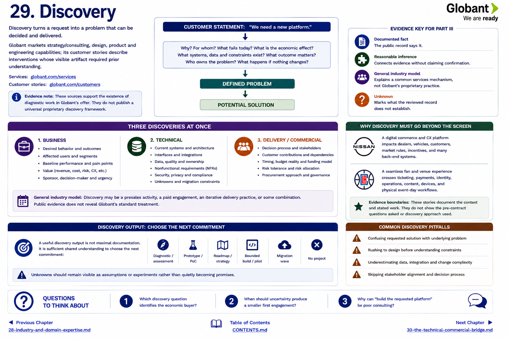

[Inside Globant](../../README.md) · [Part III — How Deals Happen](README.md)

# Chapter 29 — Discovery



Discovery turns a request into a problem that can be decided and delivered. Globant markets strategy/consulting, design, product and engineering capabilities; its customer stories describe interventions whose visible artifact required prior understanding ([Services](https://www.globant.com/services), [customer stories](https://www.globant.com/customers)). Those sources support the existence of diagnostic work in the offer. They do **not** publish a universal proprietary discovery framework.

```text
CUSTOMER STATEMENT: “We need a new platform.”
                    ↓
 Why? For whom? What fails today? What is the economic effect?
 What systems, data and constraints exist? What outcome matters?
 Who owns the problem? What happens if nothing changes?
                    ↓
              DEFINED PROBLEM
                    ↓
             POTENTIAL SOLUTION
```

## Three discoveries at once

1. **Business:** desired behavior, affected users, baseline, value, sponsor and urgency.
2. **Technical:** estate, interfaces, data, nonfunctional requirements, security, unknowns and migration constraints.
3. **Delivery/commercial:** decision process, customer contributions, timing, budget reality and acceptable risk allocation.

This is a **general industry model**. Discovery may be a presales activity, a paid engagement, an iterative delivery practice, or some combination; public evidence does not reveal Globant's standard treatment.

The Nissan and Intuit Dome cases show why discovery cannot stop at a screen. A journey crosses systems, vendors, physical operations and organizational owners ([Nissan](https://www.globant.com/customers/nissan), [LA Clippers announcement](https://www.nba.com/clippers/news/la-clippers-announce-globant-as-digital-transformation-partner)). These stories document the context and stated work, not the questions asked before contract.

A useful discovery output is not maximal documentation. It is sufficient shared understanding to choose the next commitment: a diagnostic, prototype, roadmap, bounded build, migration wave—or no project. Unknowns should remain visible as assumptions or experiments rather than quietly becoming promises.

## Questions to Think About

1. Which discovery question identifies the economic buyer?
2. When should uncertainty produce a smaller first engagement?
3. Why can “build the requested platform” be poor consulting?

---

[Previous Chapter](28-industry-and-domain-expertise.md) | [Table of Contents](../../CONTENTS.md) | [Next Chapter](30-the-technical-commercial-bridge.md)
