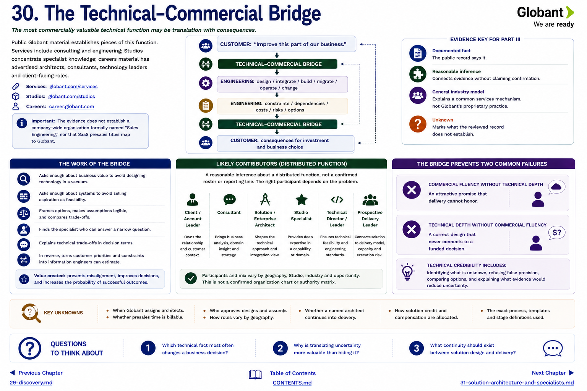

[Inside Globant](../../README.md) · [Part III — How Deals Happen](README.md)

# Chapter 30 — The Technical–Commercial Bridge



The most commercially valuable technical function may be translation with consequences.

```text
CUSTOMER: “Improve this part of our business.”
                  ↓
       TECHNICAL–COMMERCIAL BRIDGE
                  ↓
ENGINEERING: design / integrate / build / migrate / operate / change

ENGINEERING: constraints / dependencies / costs / risks / options
                  ↓
       TECHNICAL–COMMERCIAL BRIDGE
                  ↓
CUSTOMER: consequences for investment and business choice
```

Public Globant material establishes pieces of this function. Services include consulting and engineering; Studios concentrate specialist knowledge; careers material has advertised architects, consultants, technology leaders and client-facing roles ([Services](https://www.globant.com/services), [Studios](https://www.globant.com/studios), [Careers](https://career.globant.com/)). The evidence does **not** establish a company-wide organization formally named “Sales Engineering,” nor that SaaS presales titles map to Globant.

## The work of the bridge

The bridge asks enough about business value to avoid designing technology in a vacuum and enough about systems to avoid selling aspiration as feasibility. It frames options, makes assumptions legible, finds the specialist who can answer a narrow question, and explains technical trade-offs in decision terms. In reverse, it turns customer priorities and constraints into information engineers can estimate.

Likely contributors include a client/account leader, consultant, solution or enterprise architect, Studio specialist, technical director and prospective delivery leader. This is a **reasonable inference about a distributed function**, not a confirmed roster or reporting line. The right participant depends on the problem.

The bridge creates value by preventing two failures:

* **commercial fluency without technical depth:** an attractive promise that delivery cannot honor;
* **technical depth without commercial fluency:** a correct design that never connects to a funded decision.

Technical credibility is not saying yes quickly. It includes identifying what is unknown, refusing false precision, comparing options, and explaining what evidence would reduce uncertainty. The bridge thus protects customer value, provider economics and future trust simultaneously.

**Unknown:** when Globant assigns architects, whether presales time is billable, who approves designs, how roles vary by geography, and whether a named architect continues into delivery.

## Questions to Think About

1. Which technical fact most often changes a business decision?
2. Why is translating uncertainty more valuable than hiding it?
3. What continuity should exist between solution design and delivery?

---

[Previous Chapter](29-discovery.md) | [Table of Contents](../../CONTENTS.md) | [Next Chapter](31-solution-architecture-and-specialists.md)
