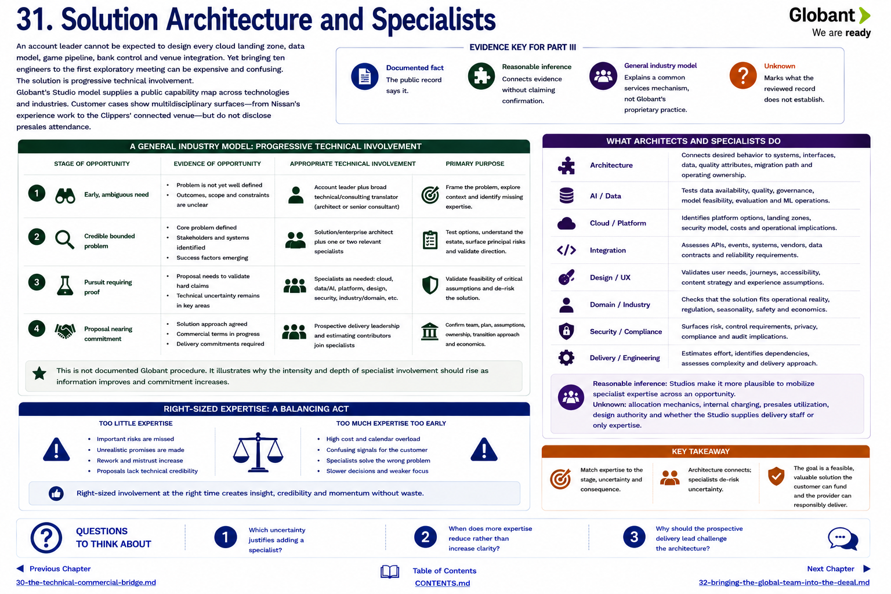

[Inside Globant](../../README.md) · [Part III — How Deals Happen](README.md)

# Chapter 31 — Solution Architecture and Specialists

An account leader cannot be expected to design every cloud landing zone, data model, game pipeline, bank control and venue integration. Yet bringing ten engineers to the first exploratory meeting can be expensive and confusing. The solution is **progressive technical involvement**.

Globant's Studio model supplies a public capability map across technologies and industries ([Studios](https://www.globant.com/studios)). Customer cases show multidisciplinary surfaces—from Nissan's experience work to the Clippers' connected venue—but do not disclose presales attendance ([Nissan](https://www.globant.com/customers/nissan), [LA Clippers](https://www.nba.com/clippers/news/la-clippers-announce-globant-as-digital-transformation-partner)).

## A general industry model

| Evidence of opportunity | Appropriate involvement | Purpose |
|---|---|---|
| early, ambiguous need | account lead plus broad technical/consulting translator | frame problem and identify missing expertise |
| credible bounded problem | architect and one or two relevant specialists | test options, estate and principal risks |
| pursuit requiring proof | cloud/data/AI/platform/design/industry specialists as needed | validate the hard claims |
| proposal nearing commitment | prospective delivery leadership and estimating contributors | confirm team, plan, assumptions and ownership |

This is not documented Globant procedure. It illustrates why specialist intensity should rise with information and commitment.

Architecture connects desired behavior to systems, interfaces, quality attributes, migration and operating ownership. Specialists deepen the uncertain portions: an AI specialist tests data and evaluation feasibility; a cloud specialist identifies platform and security implications; a designer tests user assumptions; a platform specialist distinguishes configuration from custom engineering; a domain specialist checks operational validity.

**Reasonable inference:** Studios make specialist mobilization across an opportunity more plausible. **Unknown:** allocation mechanics, internal charging, presales utilization, design authority and whether the Studio supplies delivery staff or only expertise. A Studio directory is not a staffing promise.

## Questions to Think About

1. Which uncertainty justifies adding a specialist?
2. When does more expertise reduce rather than increase clarity?
3. Why should the prospective delivery lead challenge the architecture?

---

[Previous Chapter](30-the-technical-commercial-bridge.md) | [Table of Contents](../../CONTENTS.md) | [Next Chapter](32-bringing-the-global-team-into-the-deal.md)
