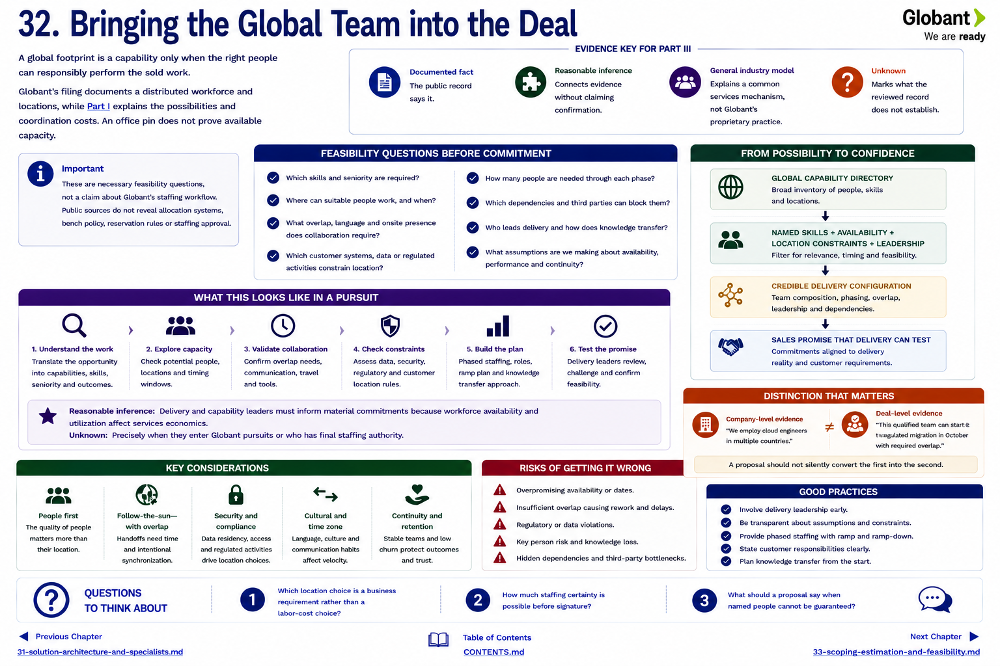

[Inside Globant](../../README.md) · [Part III — How Deals Happen](README.md)

# Chapter 32 — Bringing the Global Team into the Deal



A global footprint is a capability only when the right people can responsibly perform the sold work. Globant's filing documents a distributed workforce and locations, while [Part I](../part-1-understanding-globant/04-the-global-delivery-model.md) explains the possibilities and coordination costs ([FY2024 Form 20-F](https://www.sec.gov/edgar/browse/?CIK=1557860&owner=exclude)). An office pin does not prove available capacity.

Before commitment, somebody must eventually answer:

* Which skills and seniority are required?
* Where can suitable people work, and when?
* What overlap, language and onsite presence does collaboration require?
* Which customer systems, data or regulated activities constrain location?
* How many people are needed through each phase?
* Which dependencies and third parties can block them?
* Who leads delivery and how does knowledge transfer?

These are necessary feasibility questions, not a claim about Globant's staffing workflow. Public sources do not reveal allocation systems, bench policy, reservation rules or staffing approval.

## From possibility to confidence

```text
GLOBAL CAPABILITY DIRECTORY
          ↓
named skills + availability + location constraints + leadership
          ↓
CREDIBLE DELIVERY CONFIGURATION
          ↓
SALES PROMISE THAT DELIVERY CAN TEST
```

The distinction matters. “We employ cloud engineers” is company-level evidence. “This qualified team can start this regulated migration in October with required overlap” is deal-level evidence. A proposal should not silently convert the first into the second.

**Reasonable inference:** delivery and capability leaders must inform material commitments because workforce availability and utilization affect services economics. **Unknown:** precisely when they enter Globant pursuits or who has final staffing authority. The commercial engine creates value when it makes delivery reality visible before signature rather than after it.

## Questions to Think About

1. Which location choice is a business requirement rather than a labor-cost choice?
2. How much staffing certainty is possible before signature?
3. What should a proposal say when named people cannot be guaranteed?

---

[Previous Chapter](31-solution-architecture-and-specialists.md) | [Table of Contents](../../CONTENTS.md) | [Next Chapter](33-scoping-estimation-and-feasibility.md)
