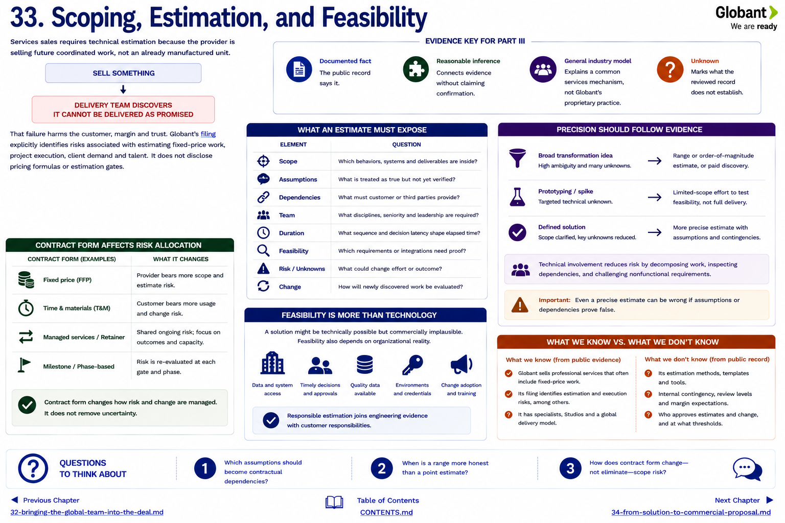

[Inside Globant](../../README.md) · [Part III — How Deals Happen](README.md)

# Chapter 33 — Scoping, Estimation, and Feasibility



Services sales requires technical estimation because the provider is selling future coordinated work, not an already manufactured unit.

```text
SELL SOMETHING
      ↓
DELIVERY TEAM DISCOVERS
IT CANNOT BE DELIVERED AS PROMISED
```

That failure harms the customer, margin and trust. Globant's filing explicitly identifies risks associated with estimating fixed-price work, project execution, client demand and talent ([FY2024 Form 20-F](https://www.sec.gov/edgar/browse/?CIK=1557860&owner=exclude)). It does not disclose pricing formulas or estimation gates.

## What an estimate must expose

| Element | Question |
|---|---|
| scope | which behaviors, systems and deliverables are inside? |
| assumptions | what is treated as true but not yet verified? |
| dependencies | what must customer or third parties provide? |
| team | what disciplines, seniority and leadership are required? |
| duration | what sequence and decision latency shape elapsed time? |
| feasibility | which requirements or integrations need proof? |
| risk/unknowns | what could change effort or outcome? |
| change | how will newly discovered work be evaluated? |

Estimate precision should follow evidence. A broad transformation idea may justify a range or paid discovery, not a single confident number. A prototype can test a technical unknown without proving production scalability. Technical involvement reduces risk by decomposing work, inspecting dependencies and challenging nonfunctional requirements.

Under a **general industry model**, scope can be stabilized, divided into milestones, managed as an evolving backlog, or separated into discovery and delivery. The commercial form changes who bears which consequences; it does not remove uncertainty. **Unknown:** Globant's standard estimation artifacts, contingencies, review levels, margins or change authority.

Feasibility includes organizational reality. A build can be technically possible but commercially implausible if the customer cannot supply data, decisions, access or change adoption. Responsible estimation therefore joins engineering evidence with customer responsibilities.

## Questions to Think About

1. Which assumptions should become contractual dependencies?
2. When is a range more honest than a point estimate?
3. How does contract form change—not eliminate—scope risk?

---

[Previous Chapter](32-bringing-the-global-team-into-the-deal.md) | [Table of Contents](../../CONTENTS.md) | [Next Chapter](34-from-solution-to-commercial-proposal.md)
