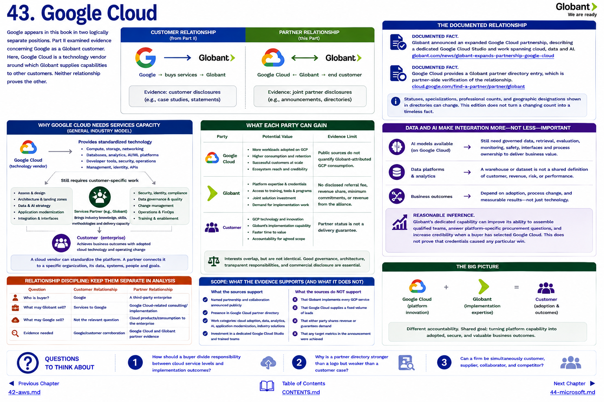

[Inside Globant](../../README.md) · [Part IV — The Partner Ecosystem](README.md) · [Partner Index](../../appendix/partner-index.md)

# Chapter 43 — Google Cloud



Google appears in this book in two logically separate positions. Part II examined evidence concerning Google as a Globant customer. Here, Google Cloud is a technology vendor around which Globant supplies capabilities to other customers. Neither relationship proves the other.

```text
CUSTOMER RELATIONSHIP                    PARTNER RELATIONSHIP
Google → buys services → Globant         Google Cloud ↔ Globant → end customer
Evidence: customer disclosures           Evidence: joint partner disclosures
```

## The documented relationship

**DOCUMENTED FACT.** Globant announced an [expanded Google Cloud partnership](https://www.globant.com/news/globant-expands-partnership-google-cloud), describing a dedicated Google Cloud Studio and work spanning cloud, data and AI. Google Cloud separately provides a [Globant partner directory entry](https://cloud.google.com/find-a-partner/partner/globant), which is partner-side verification. Statuses, specializations, professional counts, and geographic designations shown in directories can change; this edition does not turn a changing count into a timeless fact.

The relationship has both capability and market dimensions: trained teams can build on Google Cloud, while joint positioning can make the combination visible to customers. Public sources do not disclose lead attribution, revenue sharing, minimum commitments, or revenue earned from the alliance.

## Why Google Cloud needs services capacity

**GENERAL INDUSTRY MODEL.** A cloud vendor can standardize compute, storage, databases, analytics, model access, and management tooling. It cannot preconfigure every customer's data definitions, permissions, application dependencies, regulatory controls, or employee workflows. Service partners expand the practical capacity to perform that last mile—and often the many miles before it.

For Globant, Google Cloud creates a technical substrate for data platforms, application modernization, and AI-enabled products. For Google Cloud, a Globant team can help turn product availability into adopted workloads. For the customer, the two parties can provide different forms of accountability: the vendor for the platform and Globant for agreed implementation scope.

## Data and AI make integration more—not less—important

Generative AI can be exposed through a managed cloud service, yet enterprise use still depends on governed data, identity, retrieval, evaluation, monitoring, interfaces, and process ownership. That makes “model available” an input, not a business outcome. The same logic applies to analytics: a warehouse is not a shared definition of customer, revenue, or risk.

**REASONABLE INFERENCE.** Globant's dedicated capability can improve its ability to assemble qualified teams and answer platform-specific procurement questions. It may also increase credibility when a buyer has already selected Google Cloud. This does not prove that credentials caused any particular win.

## Relationship discipline

The two relationship types should remain separate in account analysis:

| Question | Customer relationship | Partner relationship |
|---|---|---|
| Who is buyer? | Google | A third-party enterprise |
| What may Globant sell? | Services to Google | Google Cloud-related consulting/implementation |
| What may Google sell? | Not the relevant question | Cloud products/consumption to the enterprise |
| Evidence needed | Google/customer corroboration | Google Cloud and Globant partner evidence |

## Questions to Think About

1. How should a buyer divide responsibility between cloud service levels and implementation outcomes?
2. Why is a partner directory stronger than a logo but weaker than a customer case?
3. Can a firm be simultaneously customer, supplier, collaborator, and competitor?

---

[Previous Chapter](42-aws.md) | [Table of Contents](../../CONTENTS.md) | [Next Chapter](44-microsoft.md)
