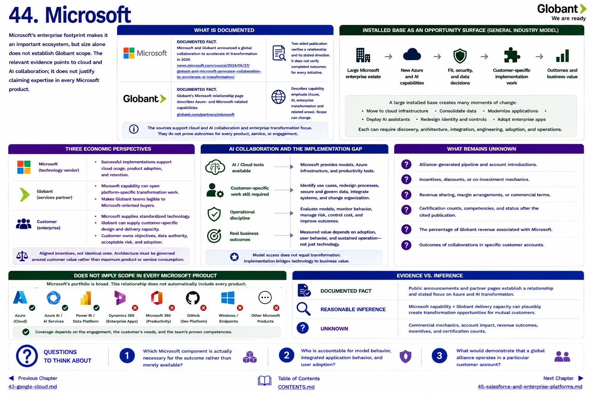

[Inside Globant](../../README.md) · [Part IV — The Partner Ecosystem](README.md) · [Partner Index](../../appendix/partner-index.md)

# Chapter 44 — Microsoft



Microsoft's enterprise footprint makes it an important ecosystem, but size alone does not establish Globant scope. The relevant evidence points to cloud and AI collaboration; it does not justify claiming expertise in every Microsoft product.

## What is documented

**DOCUMENTED FACT.** Microsoft and Globant announced a [global collaboration to accelerate AI transformation](https://news.microsoft.com/source/2024/06/27/globant-and-microsoft-announce-collaboration-to-accelerate-ai-transformation/) in 2024. Globant's corresponding [Microsoft relationship page](https://www.globant.com/partners/microsoft) describes Azure- and Microsoft-related capabilities. Two-sided publication verifies a relationship and its stated direction. It does not verify completed outcomes for every initiative.

The source supports emphasis on Azure and AI and references enterprise transformation. Microsoft technology may also include data and productivity components where the cited offering says so. This chapter does **not** assume Dynamics, Microsoft 365, Copilot, GitHub, or every Azure service is in every engagement merely because they belong to Microsoft.

## Installed base as an opportunity surface

**GENERAL INDUSTRY MODEL.** A large installed base creates many moments of change: an estate moves to cloud infrastructure; data is consolidated; an application is modernized; an AI assistant is connected to controlled knowledge; identities and controls are redesigned; or business processes move onto an enterprise application. Each can require discovery, architecture, integration, engineering, adoption, and operation.

```text
EXISTING MICROSOFT ESTATE + NEW AZURE / AI CAPABILITY
                         ↓
              fit, security, and data decisions
                         ↓
           customer-specific implementation work
```

The potential is not the same as captured Globant revenue. Customers can use internal staff, Microsoft services, another partner, multiple partners, or no implementation firm. Globant has to win a defined services engagement.

## Three economic perspectives

* **Microsoft:** successful implementations can support cloud usage, product adoption, and retention.
* **Globant:** Microsoft capability can open platform-specific transformation work and make its teams legible to Microsoft-oriented buyers.
* **Customer:** Microsoft supplies standardized technology; Globant can supply customer-specific design and delivery capacity.

Those are aligned incentives, not identical ones. Architecture must be governed around customer value rather than maximum product or service consumption.

## AI collaboration and the implementation gap

Model access does not identify the right process, secure the right data, establish evaluation thresholds, redesign human work, or operate the application. Microsoft can make AI and cloud tooling available. Globant can help perform the customer-specific work. The customer must still own objectives, acceptable risk, data authority, and organizational adoption.

**UNKNOWN:** alliance-generated pipeline, account introductions, incentives, discounts, revenue sharing, certification totals after the cited publication, and the percentage of Globant revenue associated with Microsoft.

## Questions to Think About

1. Which Microsoft component is actually necessary for the outcome rather than merely available?
2. Who is accountable for model behavior, integrated application behavior, and user adoption?
3. What would demonstrate that a global alliance operates in a particular customer account?

---

[Previous Chapter](43-google-cloud.md) | [Table of Contents](../../CONTENTS.md) | [Next Chapter](45-salesforce-and-enterprise-platforms.md)
