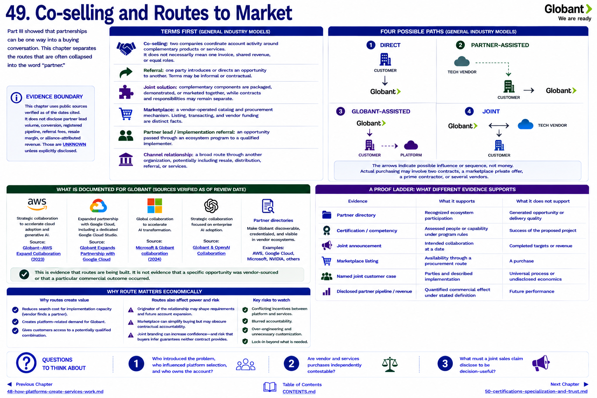

[Inside Globant](../../README.md) · [Part IV — The Partner Ecosystem](README.md) · [Partner Index](../../appendix/partner-index.md)

# Chapter 49 — Co-selling and Routes to Market



Part III showed that partnerships can be one way into a buying conversation. This chapter separates the routes that are often collapsed into the word “partner.”

## Terms first

Unless tied to a cited Globant example, these are **GENERAL INDUSTRY MODELS**:

* **Co-selling:** two companies coordinate account activity around complementary products or services. It does not necessarily mean one invoice, shared revenue, or equal roles.
* **Referral:** one party introduces or directs an opportunity to another. Terms may be informal or contractual.
* **Joint solution:** complementary components are packaged, demonstrated, or marketed together, while contracts and responsibilities may remain separate.
* **Marketplace:** a vendor-operated catalog and procurement mechanism. Listing, transacting, and vendor funding are distinct facts.
* **Partner lead / implementation referral:** an opportunity passed through an ecosystem program to a qualified implementer.
* **Channel relationship:** a broad route through another organization, potentially including resale, distribution, referral, or services.

## Four possible paths

```text
DIRECT                   PARTNER-ASSISTED
CUSTOMER                 TECH VENDOR
   ↓                          ↓
GLOBANT                  CUSTOMER → GLOBANT

GLOBANT-ASSISTED         JOINT
GLOBANT                  GLOBANT ↔ TECH VENDOR
   ↓                               ↓
CUSTOMER → PLATFORM              CUSTOMER
```

The arrows indicate possible influence or sequence, not money. Actual purchasing may involve two contracts, a marketplace private offer, a prime contractor, or several vendors.

## What is documented for Globant

The AWS strategic collaboration, Google Cloud expansion, Microsoft AI collaboration, and OpenAI collaboration document coordinated offerings or market intentions ([AWS](https://www.globant.com/news/globant-and-aws-expand-collaboration), [Google Cloud](https://www.globant.com/news/globant-expands-partnership-google-cloud), [Microsoft](https://news.microsoft.com/source/2024/06/27/globant-and-microsoft-announce-collaboration-to-accelerate-ai-transformation/), [OpenAI](https://openai.com/index/globant-collaboration/)). Official partner directories make Globant discoverable and credentialed in vendor ecosystems.

That is evidence of routes being built. It is not evidence that a specific opportunity was vendor-sourced. The public source set reviewed does not disclose partner lead volume, conversion, registered pipeline, referral fees, resale margin, or alliance-attributed revenue. Those are **UNKNOWN**.

## Why route matters economically

A vendor may encounter a customer that wants its platform but lacks implementation capacity. A services firm may encounter a business problem whose solution increases platform use. Coordinating can reduce search cost: the vendor finds implementation capacity, Globant finds platform-related demand, and the customer finds a potentially qualified combination.

Routes also affect power and risk. The party that originates and owns the executive relationship may shape requirements and account expansion. Marketplace procurement can simplify purchasing but may obscure which party remains contractually accountable. Joint branding can increase confidence while increasing the chance that buyers infer guarantees that neither contract provides.

## A proof ladder

| Evidence | What it supports | What it does not support |
|---|---|---|
| Partner directory | Recognized ecosystem participation | Generated opportunity or delivery quality |
| Certification / competency | Assessed people or capability under program rules | Success of the proposed project |
| Joint announcement | Intended collaboration at a date | Completed targets or revenue |
| Marketplace listing | Availability through a procurement route | A purchase |
| Named joint customer case | Parties and described implementation | Universal process or undisclosed economics |
| Disclosed partner pipeline/revenue | Quantified commercial effect under stated definition | Future performance |

## Questions to Think About

1. Who introduced the problem, who influenced platform selection, and who owns the account?
2. Are vendor and services purchases independently contestable?
3. What must a joint sales claim disclose to be decision-useful?

---

[Previous Chapter](48-how-platforms-create-services-work.md) | [Table of Contents](../../CONTENTS.md) | [Next Chapter](50-certifications-specialization-and-trust.md)
