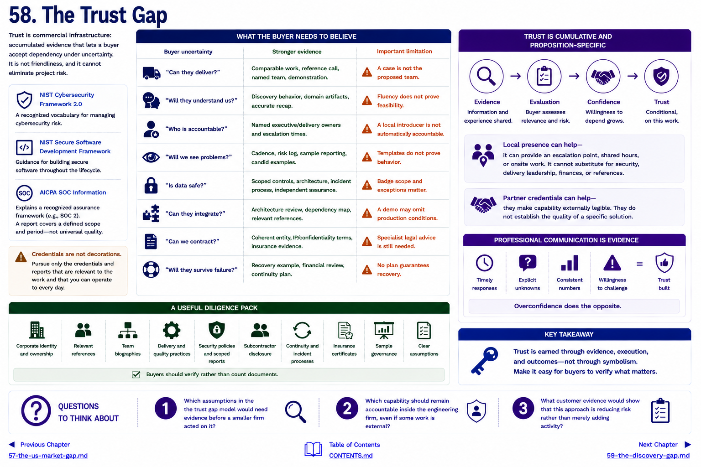

[Inside Globant](../../README.md) · [Part V — From Globant to the Small Global Engineering Firm](README.md)

# Chapter 58 — The Trust Gap

**Trust is commercial infrastructure:** accumulated evidence that lets a buyer accept dependency under uncertainty. It is not friendliness, and it cannot eliminate project risk.

The [NIST Cybersecurity Framework 2.0](https://www.nist.gov/cyberframework) and [NIST Secure Software Development Framework](https://csrc.nist.gov/Projects/ssdf) provide recognized risk and software-practice vocabularies; [AICPA's SOC information](https://www.aicpa-cima.com/topic/audit-assurance/audit-and-assurance-greater-than-soc-2) explains an assurance framework. A certification or report covers a defined scope and period. It is not a universal quality seal, and a small provider should not pursue credentials merely as decoration.

## What the buyer needs to believe

| Buyer uncertainty | Stronger evidence | Important limitation |
|---|---|---|
| “Can they deliver?” | comparable work, reference call, named team, demonstration | a case is not the proposed team |
| “Will they understand us?” | discovery behavior, domain artifacts, accurate recap | fluency does not prove feasibility |
| “Who is accountable?” | named executive/delivery owners and escalation times | a local introducer is not automatically accountable |
| “Will we see problems?” | cadence, risk log, sample reporting, candid examples | templates do not prove behavior |
| “Is data safe?” | scoped controls, architecture, incident process, independent assurance | badge scope and exceptions matter |
| “Can they integrate?” | architecture review, dependency map, relevant references | a demo may omit production conditions |
| “Can we contract?” | coherent entity, IP/confidentiality terms, insurance evidence | specialist legal advice is still needed |
| “Will they survive failure?” | recovery example, financial review, continuity plan | no plan guarantees recovery |

Professional communication is evidence in miniature. Timely notes, explicit unknowns, consistent numbers, and willingness to say “we must investigate” demonstrate how the provider may behave after signature. Overconfidence does the opposite.

Local presence can contribute an escalation point, shared hours or onsite work. It cannot substitute for security, delivery leadership, finances or references. Likewise, partner credentials can make capability externally legible but do not establish the quality of a specific solution. Trust is cumulative and proposition-specific.

A useful diligence pack contains corporate identity and ownership; relevant references; team biographies; delivery and quality practices; security policies and scoped reports; subcontractor disclosure; continuity and incident processes; insurance certificates; sample governance; and clear assumptions. Buyers should verify rather than count documents.

Trust grows fastest when discovery itself creates insight without pretending certainty. That is the subject of [Chapter 59](59-the-discovery-gap.md).

## Questions to Think About

1. Which assumptions in the the trust gap model would need evidence before a smaller firm acted on it?
2. Which capability should remain accountable inside the engineering firm, even if some work is external?
3. What customer evidence would show that this approach is reducing risk rather than merely adding activity?

---

[Previous Chapter](57-the-us-market-gap.md) | [Table of Contents](../../CONTENTS.md) | [Next Chapter](59-the-discovery-gap.md)
