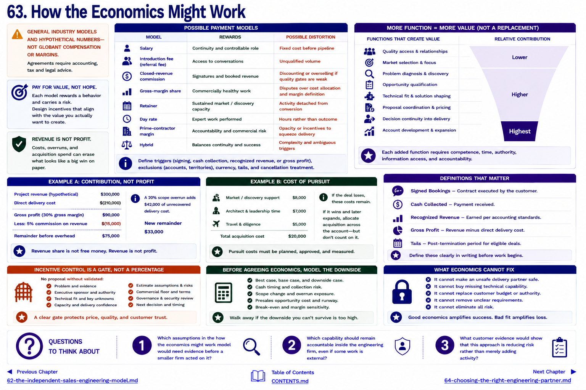

[Inside Globant](../../README.md) · [Part V — From Globant to the Small Global Engineering Firm](README.md)

# Chapter 63 — How the Economics Might Work

> **GENERAL INDUSTRY MODELS AND HYPOTHETICAL NUMBERS—NOT GLOBANT COMPENSATION OR MARGINS.** Agreements require accounting, tax and legal advice.

Possible payments include salary, commission, referral fee, revenue share, retainer, consulting fee/day rate, project margin, or a hybrid. Each pays for a different risk and behavior.

| Model | Rewards | Possible distortion |
|---|---|---|
| salary | continuity and controllable role | fixed cost before pipeline |
| introduction fee | access | unqualified volume |
| closed-revenue commission | signatures | discounting or overselling if quality gates are weak |
| gross-margin share | commercially healthy work | disputes over cost allocation |
| retainer | sustained market/discovery capacity | activity detached from conversion |
| day rate | expert work performed | hours rather than outcome |
| prime-contractor margin | accountability and commercial risk | opacity or incentives to squeeze delivery |
| hybrid | balances continuity and success | complexity and ambiguous triggers |

## Example A: contribution, not profit

A hypothetical project has **$300,000 revenue** and **$210,000 direct delivery cost**, leaving **$90,000 gross profit** (30% gross margin) before sales compensation and overhead. A **5% commission on revenue** is $15,000, leaving $75,000 before general expenses. A 20% scope overrun that adds $42,000 of unrecovered delivery cost reduces that remainder to $33,000. “Revenue share” is therefore not free money, and revenue is not profit.

## Example B: cost of pursuit

Suppose a firm spends $8,000 on market/discovery support, $7,000 of architect and leadership time, and $5,000 on travel/diligence: $20,000 acquisition cost for that attempt. If the deal loses, those costs remain. If it wins and later expands, acquisition cost should be considered across the account—but hoped-for expansion should not rescue a bad first-deal price.

Compensation should follow controllable value. An introducer does not own delivery outcome. A person who runs discovery, qualification, proposal coordination and account continuity contributes more, while still not replacing architecture or delivery. Define whether payment attaches to signed bookings, collected cash, recognized revenue, or gross profit; address cancellation, nonpayment, renewals, expansion, excluded accounts, currency and post-termination tails.

The strongest incentive control is not a clever percentage. It is a gate: no proposal without validated problem, sponsor, technical fit, capacity, estimate assumptions, commercial floor, risk review and next decision. The provider should model downside, cash timing and presales opportunity cost before agreeing economics.

Economics cannot make an unsafe delivery partner safe. [Chapter 64](64-choosing-the-right-engineering-partner.md) begins with reputation at risk.

## Questions to Think About

1. Which assumptions in the how the economics might work model would need evidence before a smaller firm acted on it?
2. Which capability should remain accountable inside the engineering firm, even if some work is external?
3. What customer evidence would show that this approach is reducing risk rather than merely adding activity?

---

[Previous Chapter](62-the-independent-sales-engineering-model.md) | [Table of Contents](../../CONTENTS.md) | [Next Chapter](64-choosing-the-right-engineering-partner.md)
