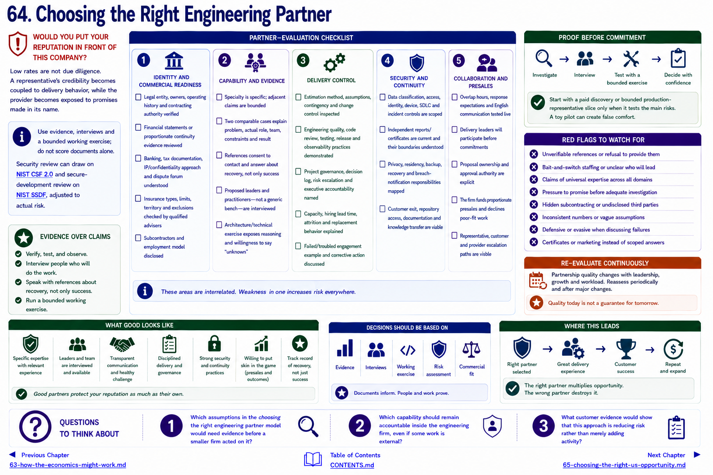

[Inside Globant](../../README.md) · [Part V — From Globant to the Small Global Engineering Firm](README.md)

# Chapter 64 — Choosing the Right Engineering Partner

> **WOULD YOU PUT YOUR REPUTATION IN FRONT OF THIS COMPANY?**

Low rates are not due diligence. A representative's credibility becomes coupled to delivery behavior, while the provider becomes exposed to promises made in its name. Use evidence, interviews and a bounded working exercise; do not score documents alone. Security review can draw on [NIST CSF 2.0](https://www.nist.gov/cyberframework) and secure-development review on the [NIST SSDF](https://csrc.nist.gov/Projects/ssdf), adjusted to actual risk.

## Partner-evaluation checklist

### Identity and commercial readiness
- [ ] legal entity, owners, operating history and contracting authority verified
- [ ] financial statements or proportionate continuity evidence reviewed
- [ ] banking, tax documentation, IP/confidentiality approach and dispute forum understood
- [ ] insurance types, limits, territory and exclusions checked by qualified advisers
- [ ] subcontractors and employment model disclosed

### Capability and evidence
- [ ] specialty is specific; adjacent claims are bounded
- [ ] two comparable cases explain problem, actual role, team, constraints and result
- [ ] references consent to contact and answer about recovery, not only success
- [ ] proposed leaders and practitioners—not a generic bench—are interviewed
- [ ] architecture/technical exercise exposes reasoning and willingness to say “unknown”

### Delivery control
- [ ] estimation method, assumptions, contingency and change control inspected
- [ ] engineering quality, code review, testing, release and observability practices demonstrated
- [ ] project governance, decision log, risk escalation and executive accountability named
- [ ] capacity, hiring lead time, attrition and replacement behavior explained
- [ ] failed/troubled engagement example and corrective action discussed

### Security and continuity
- [ ] data classification, access, identity, device, SDLC and incident controls are scoped
- [ ] independent reports/certificates are current and their boundaries understood
- [ ] privacy, residency, backup, recovery and breach-notification responsibilities mapped
- [ ] customer exit, repository access, documentation and knowledge transfer are viable

### Collaboration and presales
- [ ] overlap hours, response expectations and English communication tested live
- [ ] delivery leaders will participate before commitments
- [ ] proposal ownership and approval authority are explicit
- [ ] the firm funds proportionate presales and declines poor-fit work
- [ ] representative, customer and provider escalation paths are visible

Red flags include unverifiable references, bait-and-switch staffing, universal expertise, pressure to promise before investigation, hidden subcontracting, inconsistent numbers, defensive handling of failure, and certificates offered instead of scoped answers.

Start with a paid discovery or bounded production-representative slice only when it tests the main risks. A toy pilot can create false comfort. Re-evaluate periodically; partnership quality changes with leadership, growth and workload. The reusable framework appears in the [partner-evaluation appendix](../../appendix/partner-evaluation-framework.md).

The same discipline must qualify demand, addressed in [Chapter 65](65-choosing-the-right-us-opportunity.md).

## Questions to Think About

1. Which assumptions in the choosing the right engineering partner model would need evidence before a smaller firm acted on it?
2. Which capability should remain accountable inside the engineering firm, even if some work is external?
3. What customer evidence would show that this approach is reducing risk rather than merely adding activity?

---

[Previous Chapter](63-how-the-economics-might-work.md) | [Table of Contents](../../CONTENTS.md) | [Next Chapter](65-choosing-the-right-us-opportunity.md)
