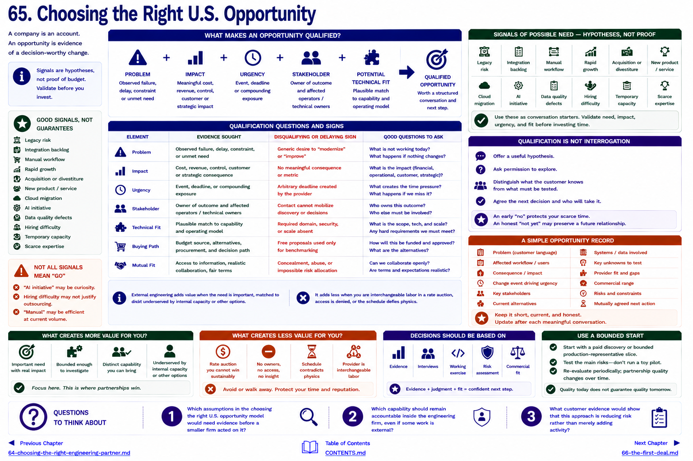

[Inside Globant](../../README.md) · [Part V — From Globant to the Small Global Engineering Firm](README.md)

# Chapter 65 — Choosing the Right U.S. Opportunity



A company is an account. An opportunity is evidence of a decision-worthy change.

```text
PROBLEM + IMPACT + URGENCY + STAKEHOLDER + POTENTIAL TECHNICAL FIT
                           ↓
                 qualified opportunity
```

Signals include legacy risk, integration backlog, manual workflow, rapid growth, acquisition, new product, cloud migration, AI initiative, data defects, hiring difficulty, temporary capacity, or scarce expertise. They are hypotheses, not proof of budget. “AI initiative” may be curiosity; “hiring difficulty” may not justify outsourcing; “manual” may be efficient at current volume.

## Qualification questions

| Element | Evidence sought | Disqualifying or delaying sign |
|---|---|---|
| problem | observed failure, delay, constraint or unmet need | generic desire to “modernize” |
| impact | cost, revenue, control, customer or strategic consequence | no meaningful consequence |
| urgency | event, deadline or compounding exposure | arbitrary provider-created deadline |
| stakeholder | owner of outcome and affected operators/technical owners | contact cannot mobilize discovery |
| technical fit | plausible match to capability and operating model | required domain/security/scale absent |
| buying path | budget source, alternatives, procurement and decision | free proposal used only for benchmarking |
| mutual fit | access to information, realistic collaboration, fair terms | concealment, abuse, impossible allocation of risk |

External engineering creates more value when the need is important, bounded enough to investigate, matched to distinct capability, and underserved by internal capacity or other options. It creates less when the provider is interchangeable labor in a rate auction it cannot win sustainably, the buyer will not provide owners or access, or the schedule contradicts physics.

Qualification is not interrogation. Offer a useful hypothesis, ask permission, distinguish what the customer knows from what must be tested, and agree the next decision. An early “no” protects scarce presales and engineering attention. An honest “not yet” may preserve a future relationship.

A simple opportunity record should contain the problem in customer language; affected workflow/users; consequence; change event; stakeholders; current alternatives; systems/data; key unknowns; provider fit/gaps; commercial range; risks; and the mutually agreed next action. See the [opportunity framework](../../appendix/opportunity-qualification-framework.md).

[Chapter 66](66-the-first-deal.md) applies this model without pretending the first deal is easy.

## Questions to Think About

1. Which assumptions in the choosing the right u.s. opportunity model would need evidence before a smaller firm acted on it?
2. Which capability should remain accountable inside the engineering firm, even if some work is external?
3. What customer evidence would show that this approach is reducing risk rather than merely adding activity?

---

[Previous Chapter](64-choosing-the-right-engineering-partner.md) | [Table of Contents](../../CONTENTS.md) | [Next Chapter](66-the-first-deal.md)
