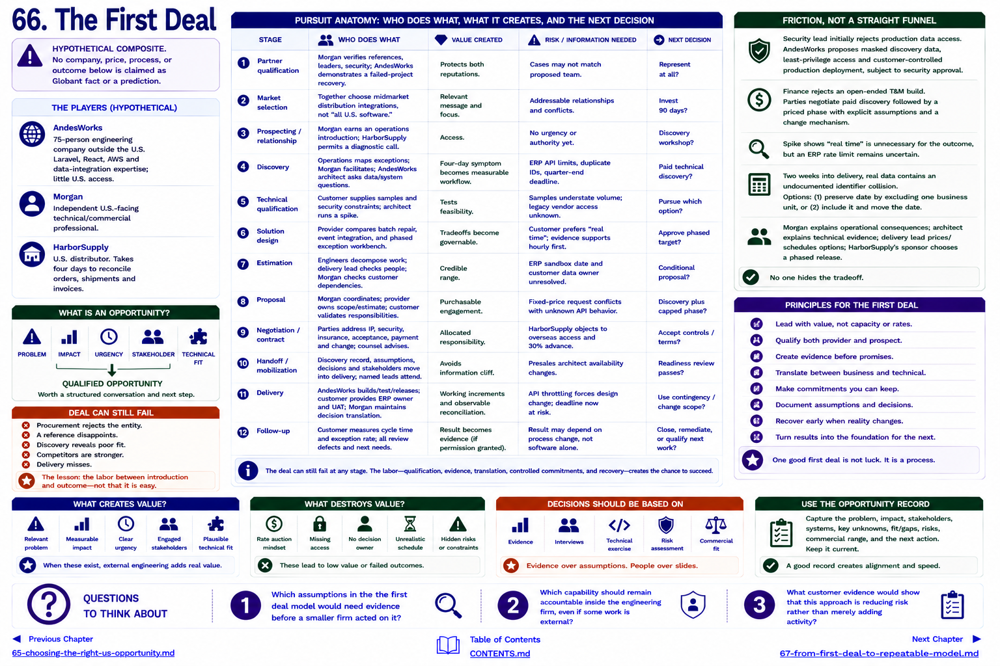

[Inside Globant](../../README.md) · [Part V — From Globant to the Small Global Engineering Firm](README.md)

# Chapter 66 — The First Deal

> **HYPOTHETICAL COMPOSITE. No company, price, process, or outcome below is claimed as Globant fact or a prediction.**

AndesWorks is a 75-person company outside the United States with credible Laravel, React, AWS and data-integration work but little U.S. access. Morgan is an independent U.S.-facing technical/commercial professional. HarborSupply, a U.S. distributor, takes four days to reconcile orders, shipments and invoices.

## Pursuit anatomy

| Stage | Who does what | Value created | Risk / information needed | Next decision |
|---|---|---|---|---|
| partner qualification | Morgan verifies references, leaders, security; AndesWorks demonstrates a failed-project recovery | protects both reputations | cases may not match proposed team | represent at all? |
| market selection | together choose midmarket distribution integrations, not “all U.S. software” | relevant message | addressable relationships and conflicts | invest 90 days? |
| prospecting/relationship | Morgan earns an operations introduction; HarborSupply permits a diagnostic call | access | no urgency or authority yet | discovery workshop? |
| discovery | operations maps exceptions; Morgan facilitates; AndesWorks architect asks data/system questions | four-day symptom becomes measurable workflow | ERP API limits, duplicate IDs, quarter-end deadline | paid technical discovery? |
| technical qualification | customer supplies samples and security constraints; architect runs a spike | tests feasibility | samples understate volume; legacy vendor access unknown | pursue which option? |
| solution design | provider compares batch repair, event integration, and phased exception workbench | tradeoffs become governable | customer prefers “real time”; evidence supports hourly first | approve phased target? |
| estimation | engineers decompose work; delivery lead checks people; Morgan checks customer dependencies | credible range | ERP sandbox date and customer data owner unresolved | conditional proposal? |
| proposal | Morgan coordinates; provider owns scope/estimate; customer validates responsibilities | purchasable engagement | fixed-price request conflicts with unknown API behavior | discovery plus capped phase? |
| negotiation/contract | parties address IP, security, insurance, acceptance, payment and change; counsel advises | allocated responsibility | HarborSupply objects to overseas access and 30% advance | accept controls/terms? |
| handoff/mobilization | discovery record, assumptions, decisions and stakeholders move into delivery; named leads attend | avoids information cliff | presales architect availability changes | readiness review passes? |
| delivery | AndesWorks builds/test/releases; customer provides ERP owner and UAT; Morgan maintains decision translation | working increments and observable reconciliation | API throttling forces design change; deadline now at risk | use contingency/change scope? |
| follow-up | customer measures cycle time and exception rate; all review defects and next needs | result becomes evidence if permission granted | result may depend on process change, not software alone | close, remediate, or qualify next work? |

## Friction, not a straight funnel

HarborSupply's security lead initially rejects production data access. AndesWorks proposes masked discovery data, least-privilege access and customer-controlled production deployment, subject to security approval. Finance rejects an open-ended T&M build; the parties negotiate paid discovery followed by a priced phase with explicit assumptions and a change mechanism. During the spike, “real time” proves unnecessary for the outcome, but an ERP rate limit remains uncertain.

Two weeks into delivery, real data contains an undocumented identifier collision. The team can preserve the date by excluding one business unit, or include it and move the date. Morgan explains operational consequences; the architect explains technical evidence; the delivery lead prices/schedules options; HarborSupply's sponsor chooses a phased release. No one hides the tradeoff.

The deal can still fail: procurement may reject the entity, a reference may disappoint, discovery may reveal poor fit, competitors may be stronger, or delivery may miss. The lesson is the labor between introduction and outcome—qualification, evidence, translation, controlled commitments and recovery—not that cross-border deals are easy.

The expanded table appears in [Deal Anatomy](../../appendix/deal-anatomy.md). [Chapter 67](67-from-first-deal-to-repeatable-model.md) asks when this becomes a system.

## Questions to Think About

1. Which assumptions in the the first deal model would need evidence before a smaller firm acted on it?
2. Which capability should remain accountable inside the engineering firm, even if some work is external?
3. What customer evidence would show that this approach is reducing risk rather than merely adding activity?

---

[Previous Chapter](65-choosing-the-right-us-opportunity.md) | [Table of Contents](../../CONTENTS.md) | [Next Chapter](67-from-first-deal-to-repeatable-model.md)
