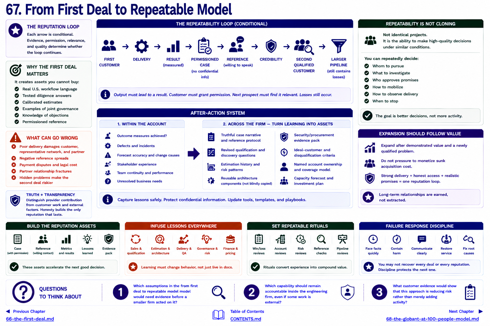

[Inside Globant](../../README.md) · [Part V — From Globant to the Small Global Engineering Firm](README.md)

# Chapter 67 — From First Deal to Repeatable Model



```text
FIRST CUSTOMER → DELIVERY → RESULT → PERMISSIONED CASE → REFERENCE
      → CREDIBILITY → SECOND QUALIFIED CUSTOMER → LARGER PIPELINE
```

The arrows are conditional. Delivery output must produce or credibly enable a measured result; the customer must permit disclosure; the next prospect must consider the case relevant; and a larger pipeline still contains losses.

A first engagement matters disproportionately because it creates assets the provider could not buy: language from a real U.S. workflow, tested diligence answers, a calibrated estimate, examples of joint governance, knowledge of objections, and possibly a reference. Capture these without exposing confidential information. Distinguish the provider's contribution from the customer's work and external factors.

## After-action system

Within the account, review outcome measures, defects, incidents, forecast accuracy, change causes, stakeholder experience, team continuity and unresolved business needs. Across the firm, convert learning into:

* a truthful case narrative and reference protocol;
* revised qualification and discovery questions;
* estimation history and risk patterns;
* reusable—but not blindly copied—architecture components;
* a security/procurement evidence pack;
* clearer ideal-customer and disqualification criteria;
* named account ownership and a capacity forecast.

Repeatability does not mean identical projects. It means the firm can repeatedly make high-quality decisions under similar conditions: whom to pursue, what to investigate, who approves promises, how to mobilize, how to observe delivery, and when to stop.

Failure compounds too. A poorly delivered first deal can cost the customer, damage the representative's network, generate a negative reference, create payment disputes, and fracture the partner relationship. Hiding it makes the second deal riskier. A disciplined response contains harm, communicates facts, restores service, identifies systemic causes, compensates where contractually appropriate, and changes controls. Not every relationship or reputation can be recovered.

Sales cannot compensate for weak delivery; delivery cannot compensate for absent access forever. Partner selection, promise quality and delivery quality form one reputation loop. Account expansion should follow demonstrated value and a newly qualified problem—not pressure to monetize sunk acquisition cost.

[Chapter 68](68-the-globant-at-100-people-model.md) assembles the smallest useful commercial system around that loop.

## Questions to Think About

1. Which assumptions in the from first deal to repeatable model model would need evidence before a smaller firm acted on it?
2. Which capability should remain accountable inside the engineering firm, even if some work is external?
3. What customer evidence would show that this approach is reducing risk rather than merely adding activity?

---

[Previous Chapter](66-the-first-deal.md) | [Table of Contents](../../CONTENTS.md) | [Next Chapter](68-the-globant-at-100-people-model.md)
